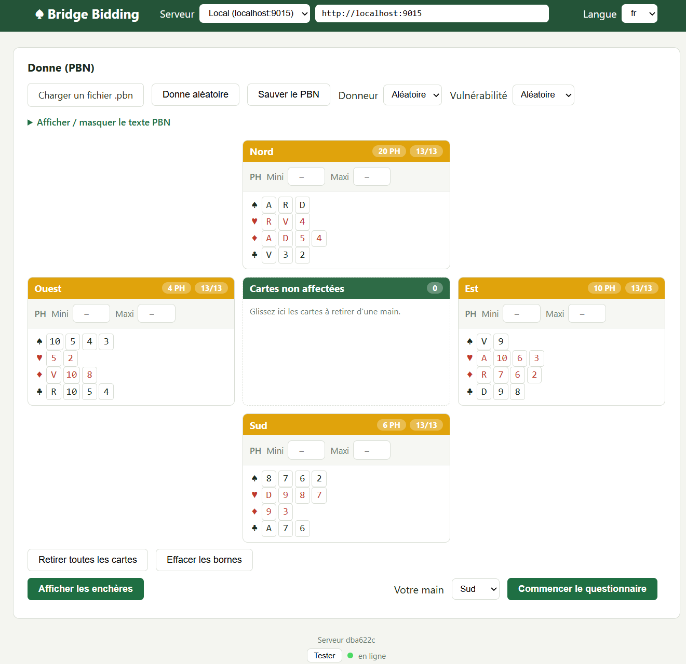

<p align="center">
  
</p>

# Bridge Bidding Server

Serveur HTTP en Go qui simule la séquence d'enchères complète d'une donne de bridge, selon le système français d'enchères (SEF), à partir d'un fichier **PBN** (voir [docs/pbn.txt](docs/pbn.txt)).

Le dépôt contient quatre morceaux, dont seul le premier est indispensable :

| | Quoi | Où |
|---|------|-----|
| **Le moteur et son API** | un binaire Go sans dépendance : `POST /bid`, `POST /bids`, plus `/health`, `/ready`, `/version` | racine du dépôt |
| **Le client web** | composition de la donne, affichage des enchères commentées, questionnaire, calcul du PAR — compilé **dans** le binaire (`//go:embed`) et servi à `/`, avec un mode qui calcule les enchères sans serveur | [cli/](cli/) |
| **Le serveur IA** *(facultatif)* | lecture des cartes sur une photo, par un modèle de vision derrière un proxy Go | [server_ai/](server_ai/) |
| **L'audit du par** *(outil de développement)* | fait jouer un lot de donnes au moteur, compare au par double-mort, publie un rapport HTML | [tools/par/](tools/par/) |

Les règles réellement appliquées par le moteur sont décrites, une par une et avec leurs seuils, dans **[docs/regles_moteur.md](docs/regles_moteur.md)**.

---

## Démarrage

```bash
./run.sh            # compile ce qu'il faut, lance le serveur, ouvre le navigateur
```

```powershell
.\run.ps1           # équivalent PowerShell
```

[run.sh](run.sh)/[run.ps1](run.ps1) produisent le moteur WebAssembly s'il manque, compilent le serveur dans `./bids` (ignoré par git), attendent que `/ready` réponde puis ouvrent la page. `Ctrl+C` arrête le serveur. Un serveur déjà en écoute sur le port est détecté : la page est alors simplement ouverte.

```bash
./run.sh -p 9200    # autre port
./run.sh -n         # ne pas ouvrir le navigateur
./run.sh -f         # recompiler cli/bids.wasm au passage
```

À la main, si l'on préfère :

```bash
./build-wasm.sh     # une fois : le moteur en WebAssembly pour le client
go run .            # ou : go build -o bids.exe . && ./bids.exe
```

Puis **http://localhost:9015/** dans un navigateur : le client est servi par le serveur lui‑même, il n'y a rien à configurer.

[build-wasm.sh](build-wasm.sh)/[build-wasm.ps1](build-wasm.ps1) produisent `cli/bids.wasm`, qui donne au client son **mode navigateur** (voir plus bas). Ils ne sont pas obligatoires : sans eux, le client interroge le serveur comme avant. Les scripts de compilation et l'image Docker les appellent d'eux-mêmes — `//go:embed` fige le contenu de `cli/` au moment où le serveur est compilé, le moteur WebAssembly doit donc exister avant.

Pour changer de port :

```bash
PORT=8080 go run .            # Linux / macOS
$env:PORT="8080"; go run .    # PowerShell
```

> ⚠️ Si un autre service occupe déjà le port 9015 (conteneur Docker/WSL par exemple), lancez le serveur sur un autre port avec la variable `PORT`.

### Variables d'environnement

| Variable | Défaut | Rôle |
|----------|--------|------|
| `PORT` | `9015` | Port d'écoute HTTP |
| `CORS_ORIGINS` | `*` | Valeur de `Access-Control-Allow-Origin` |
| `SERVE_CLI` | *(vide → client servi)* | `false` désactive le client embarqué à `/` (404 JSON à la place) |
| `LOG_LEVEL` | `INFO` | `DEBUG`, `INFO`, `WARN` ou `ERROR` |
| `LOG_FORMAT` | `json` | `text` pour des logs lisibles en développement |

## Exécutables prêts à l'emploi

Pour utiliser l'application sans chaîne Go ni Docker sur la machine cible,
[build-server.sh](build-server.sh)/[build-server.ps1](build-server.ps1) compilent
les binaires Linux et Windows dans [server/](server/) :

```bash
./build-server.sh                 # server/bids-linux et server/bids-windows.exe
./build-server.sh -o linux        # une seule cible
./build-server.sh -a arm64        # Raspberry Pi, Mac ARM...
```

```powershell
.\build-server.ps1 [-Targets linux|windows|both] [-Arch amd64|arm64]
```

Ensuite, il suffit de deux gestes :

1. **lancer l'exécutable de son système** (`./server/bids-linux` ou
   `.\server\bids-windows.exe`) — il écoute sur le port 9015 ;
2. **ouvrir http://localhost:9015** dans un navigateur.

Le client calcule les enchères dans le navigateur dès la première visite, le moteur
WebAssembly étant compilé dans le binaire lui aussi : rien à saisir ni à configurer.
Le sélecteur de l'en-tête permet de viser le serveur à la place — **Local** vise
`http://localhost:9015`. Sur un autre port
(`PORT=9415`), corrigez l'URL une fois dans l'en-tête — elle est mémorisée pour
les visites suivantes (`localStorage`), comme l'URL **Distant**. Les binaires
sont autonomes — le client est compilé dedans via `//go:embed`, si bien que
**http://localhost:9015/** affiche la même application sans passer par le
fichier local. Voir [server/README.md](server/README.md) pour les détails (port
occupé, SmartScreen, pare-feu).

Les binaires produits ne sont pas versionnés (voir [.gitignore](.gitignore)) : ils se recompilent à la demande.

## Hébergement statique (GitHub Pages)

Le client se suffit à lui-même : le moteur tourne dans le navigateur (`cli/bids.wasm`), aucun service n'est interrogé. `cli/` est donc publiable tel quel sur n'importe quel hébergeur de fichiers statiques — sans serveur Go, sans base, sans configuration.

[.github/workflows/pages.yml](.github/workflows/pages.yml) le publie sur **GitHub Pages** à chaque poussée sur `main`, et à la demande depuis l'onglet *Actions*. Le workflow :

1. lance `go test ./...` — le moteur WebAssembly *est* ce code Go, un test rouge signifierait des enchères fausses ;
2. compile `cli/bids.wasm` et `cli/wasm_exec.js` avec [build-wasm.sh](build-wasm.sh), car ces deux fichiers sont ignorés par git et n'existent pas dans le dépôt ;
3. vérifie qu'aucun fichier de `cli/` ne manque, puis publie le dossier.

Le site est servi sous **<https://jeanjacquesserpoul.github.io/encheres-bridge/>**. Tous les chemins du client sont relatifs, ce sous-répertoire ne demande donc aucun réglage.

**À faire une fois**, sur un nouveau dépôt : activer Pages dans *Paramètres > Pages*, avec **Source : GitHub Actions**. Le workflow ne peut pas s'en charger — créer le site demande des droits d'administration que le `GITHUB_TOKEN` n'a pas, et l'étape `configure-pages` échoue alors sur « Resource not accessible by integration ».

**Ce qu'un bon hébergeur statique apporte**, et qu'il faut vérifier ailleurs que sur Pages :

| Attendu | Pourquoi |
|---|---|
| `Content-Type: application/wasm` sur `.wasm` | Sans lui, `WebAssembly.instantiateStreaming` est refusé et le client retombe sur `arrayBuffer()`, plus lent et plus gourmand en mémoire |
| Compression (`gzip`/`br`) sur `.wasm` | 4,5 Mo bruts contre ~1,2 Mo compressés |
| `Cache-Control` sur les assets | Sans lui, chaque visite revalide tous les fichiers |

Un point reste hors de portée sur Pages, qui ne permet pas d'en-têtes personnalisés : `COOP`/`COEP`, nécessaires à `SharedArrayBuffer` donc au bouton **Calcul du PAR**. [cli/coi-serviceworker.js](cli/coi-serviceworker.js) les fournit à sa place, au prix d'**un rechargement de page à la première visite**. C'est précisément ce pour quoi il est là.

## Docker

```bash
docker compose up -d --build      # construit l'image et démarre le serveur sur le port 9015
PORT=9415 docker compose up -d    # publie sur un autre port hôte (le conteneur écoute toujours sur 9015)
```

ou sans compose :

```bash
docker build -t bridge-bids .
docker run -d -p 9015:9015 bridge-bids
```

[build-docker.sh](build-docker.sh)/[build-docker.ps1](build-docker.ps1) automatisent ce build : ils injectent la révision Git dans le binaire (`--build-arg REVISION`, sinon `/version` renvoie `docker`), avertissent si le dépôt est modifié et affichent la taille de l'image.

```bash
./build-docker.sh                              # construit bridge-bids:latest
./build-docker.sh -r                           # ...puis démarre le conteneur et attend /ready
./build-docker.sh -t bridge-bids:1.0 -p linux/arm64 -n
PORT=9415 ./build-docker.sh -r                 # publie la vérification sur un autre port hôte
```

```powershell
.\build-docker.ps1                             # équivalent PowerShell
.\build-docker.ps1 -Run
.\build-docker.ps1 -Image bridge-bids:1.0 -Platform linux/arm64 -NoCache
```

| Option | PowerShell | Rôle |
|--------|------------|------|
| `-t nom:tag` | `-Image` | Nom de l'image (défaut `bridge-bids:latest`) |
| `-p plateforme` | `-Platform` | Plateforme cible (`linux/amd64`, `linux/arm64`) |
| `-n` | `-NoCache` | Build sans cache |
| `-r` | `-Run` | Démarre un conteneur `bridge-bids-check`, sonde `/ready` 30 s puis affiche `/version` ; en cas d'échec, affiche les journaux et supprime le conteneur |

L'image est construite en deux étapes (compilation `golang:1.26-alpine`, exécution `alpine` avec un utilisateur non root). Le client (`cli/`) est compilé dans le binaire via `//go:embed` — aucune dépendance au répertoire de travail à l'exécution ; `SERVE_CLI=false` le désactive. Un `HEALTHCHECK` interroge `/ready` toutes les 30 s (rejoue une donne de référence dans le moteur, pas seulement un ping process).

### Image de production sans chaîne de build

Le dossier [prod/](prod/) déploie l'application sur un serveur qui n'a **ni Go ni build Docker** : son [Dockerfile](prod/Dockerfile) ne compile rien, il empaquette un binaire Linux déjà compilé.

```bash
./build-server.sh -o linux     # produit server/bids-linux
cp server/bids-linux prod/     # le binaire que prod/Dockerfile empaquette
# recopier prod/ sur le serveur, puis, depuis ce dossier :
docker compose up -d --build
```

L'image pose `SERVE_CLI=false` par défaut (API seule), mais [prod/docker-compose.yml](prod/docker-compose.yml) le remet à `true` : le déploiement de référence sert donc le client, et il suffit de retirer cette ligne pour n'exposer que `/health`, `/ready`, `/version`, `/bid` et `/bids`. Le binaire `prod/bids-linux` n'est pas versionné.

### Derrière un reverse proxy (Caddy)

Le binaire sert **tout** sur son port : l'API (`/health`, `/ready`, `/version`, `/bid`, `/bids`) **et** le client embarqué à `/`, tant que `SERVE_CLI` ≠ `false`. En local, `http://localhost:9015` suffit donc. En production, Caddy n'a qu'à renvoyer un préfixe vers le conteneur — inutile de déployer une copie disque du client.

```caddy
# Ajoute le / final : sinon les chemins relatifs de index.html
# (style.css, app.js, dds_web_wasm*.js...) se résolvent un cran trop haut.
redir /bridgequizz /bridgequizz/ 308

# Client embarqué + API, servis par le serveur Go.
# handle_path retire le préfixe : /bridgequizz/ -> /, /bridgequizz/app.js
# -> /app.js, /bridgequizz/health -> /health, etc.
handle_path /bridgequizz* {
    reverse_proxy localhost:9015
}

# Optionnel : à garder seulement si un autre client (front/...) vise
# déjà cette route. Même backend, mêmes routes après handle_path.
handle_path /api/bidings* {
    reverse_proxy localhost:9015
}

# Serveur IA (server_ai/), pour la reconnaissance des cartes par photo.
# Sur la même origine que le client : aucun réglage CORS, et rien à
# ajouter pour l'isolation cross-origine.
handle_path /aiproxy* {
    reverse_proxy localhost:9009
}
```

- Lancer le conteneur avec `SERVE_CLI=true` (déjà le cas dans [prod/docker-compose.yml](prod/docker-compose.yml)).
- Dans le client servi sous `https://<domaine>/bridgequizz/`, choisir **Serveur → Distant** et saisir `https://<domaine>/bridgequizz` (ou `https://<domaine>/api/bidings` si ce bloc est conservé). Les appels sont alors *same-origin* — aucun réglage CORS — et le mode comme l'URL sont mémorisés (`localStorage`).
- Pour la reconnaissance des cartes, cocher l'option **Serveur IA de reconnaissance des cartes**, choisir **Serveur IA → Distant** et saisir `https://<domaine>/aiproxy`. Le serveur IA est facultatif : sans lui, l'option reste décochée et rien du reste ne change.
- Le bouton **Calcul du PAR** (solveur double-mort WASM) exige l'isolation cross-origine : le serveur pose `Cross-Origin-Opener-Policy: same-origin` et `Cross-Origin-Embedder-Policy: require-corp`, `reverse_proxy` les relaie et Caddy sert en HTTPS (contexte sécurisé) — rien à ajouter. [cli/coi-serviceworker.js](cli/coi-serviceworker.js) n'est qu'un repli pour les hébergements qui retirent ces en-têtes.

---

## Le client web

Le client HTML+JS de [cli/](cli/) est servi à la racine : ouvrez **http://localhost:9015/**. Il ne dépend que de l'API — aucune étape de build, aucun paquet npm.

**L'en-tête** choisit le serveur interrogé et la langue (`fr`/`en`, mémorisée, initialisée d'après le navigateur). **Navigateur (hors ligne)** n'interroge personne : les enchères sont calculées sur place (voir plus bas). C'est le mode par défaut, et la barre du serveur disparaît alors de l'en-tête — il n'y a aucun serveur à choisir ; elle revient d'elle-même quand le moteur fait défaut, et sur demande avec `?serveur=1` (voir plus bas). **Local** vise `http://localhost:9015` par défaut ; sur un autre port ou un autre hôte, on corrige l'URL une fois et elle est mémorisée (`localStorage`). **Distant** n'a pas d'URL prédéfinie : elle dépend du déploiement, le client invite donc à la saisir, puis la mémorise de la même façon. L'API envoie les en-têtes CORS nécessaires pour piloter le serveur depuis une autre origine (`file://`, autre port...). Tout ce qui touche au serveur IA tient à une case à cocher, **décochée par défaut**, reléguée au pied de page où elle tient lieu de nom pour ce serveur (voir plus bas) ; tant qu'elle est décochée, ni la barre du serveur IA dans l'en-tête, ni les boutons appareil photo, ni son état n'apparaissent.

### Composer la donne

- **Charger un fichier .pbn**, ou coller le texte PBN dans la zone dépliable. Un fichier de tournoi (plusieurs `[Board]`) fait apparaître un sélecteur **Donne à utiliser**.
- **Donne aléatoire** tire une donne complète ; donneur et vulnérabilité se choisissent ou se tirent au sort. Un fichier chargé impose les siens jusqu'au prochain tirage.
- **À la souris** : chaque carte se glisse d'une main à l'autre, ou vers la zone **Cartes non affectées** au centre de la table ; le tag `[Deal]` est réécrit à chaque déplacement.
- Chaque main porte deux **bornes de points d'honneur** (mini/maxi). Elles contraignent le tirage aléatoire et signalent les mains hors bornes sur la donne courante.
- Trois boutons : **Compléter les mains** (visible tant qu'il reste des cartes non affectées) les répartit entre les mains incomplètes en respectant les bornes, **Retirer toutes les cartes** vide la table, **Effacer les bornes** remet les mini/maxi à vide. L'en-tête de chaque main porte une **poubelle** qui renvoie ses seules cartes dans la zone non affectée.
- **Sauver le PBN** télécharge la donne composée.

### Voir les enchères

**Afficher les enchères** appelle `POST /bid` — ou le moteur embarqué, en mode navigateur — et affiche les quatre mains autour de la table, la grille d'enchères (survolez une enchère pour lire sa signification), la liste des commentaires et le JSON brut.

### Le mode navigateur

Le moteur est aussi compilé en **WebAssembly** ([build-wasm.sh](build-wasm.sh) → `cli/bids.wasm`, ~4,5 Mo, ~1,2 Mo sur le réseau une fois compressé). Le client le précharge dès l'ouverture de la page ([cli/bids-wasm.js](cli/bids-wasm.js)), hors du chemin critique de l'affichage, et calcule les enchères dans la page : plus aucune requête, et l'application continue de fonctionner serveur éteint. C'est le même code Go que `/bid` — même parseur PBN, même moteur, même encodeur JSON (`encodeJSON`, [response.go](response.go)) — donc la réponse est la même **octet pour octet** ; [tools/wasm-parity.js](tools/wasm-parity.js) le vérifie :

```bash
node tools/wasm-parity.js               # compare les deux chemins sur testdata/*.pbn
```

La pastille d'état rejoue la donne de référence de `/ready` au lieu de sonder `/health`, et le pied de page nomme le moteur au lieu du serveur. Sans `cli/bids.wasm`, le client part sur **Local** de lui-même et ne perd rien ; l'option reste dans la liste et dit ce qui manque si on la choisit quand même.

Tant que le moteur répond, la barre du serveur disparaît de l'en-tête : il n'y a personne à choisir. Pour viser un serveur alors que tout fonctionne — la production, un autre port, ou simplement comparer les deux chemins — ouvrez le client avec **`?serveur=1`** :

```
http://localhost:9015/?serveur=1
```

`?serveur=0` la referme, de sorte qu'un signet puisse porter l'une ou l'autre forme sans ambiguïté. Le mode sélectionné est mémorisé comme les autres : les visites suivantes se passent du paramètre, la barre restant visible tant que le mode n'est pas revenu à **Navigateur**.

### Le questionnaire

**Votre main** choisit un siège, **Commencer le questionnaire** lance l'entraînement : les trois autres mains restent cachées, l'enchère se déroule pas à pas et, à chaque tour du siège choisi, une boîte à enchères n'ouvre que les enchères **légales** (palier suffisant, contre et surcontre selon le camp du dernier appelant). La réponse est comparée à celle du moteur : verdict, enchère attendue et son commentaire SEF. À la fin, les mains sont dévoilées, le score s'affiche (`n / total`, en pourcentage) avec le contrat final, et **Afficher le détail complet** ouvre la vue normale de la donne.

### Le PAR

Sous les commentaires, **Calcul du PAR** donne les levées double-mort de chaque camp dans chaque couleur, calculées dans le navigateur par le solveur DDS compilé en WebAssembly ([cli/par.js](cli/par.js)). Chaque case porte son entame : survolez-la — ou touchez-la, l'entame s'affiche alors en bandeau bas — et le solveur reprend la donne pour lister les cartes de l'entameur qui tiennent le déclarant à ce chiffre, ainsi que ce que coûtent les autres. Quand presque toutes les entames se valent, c'est la courte liste de celles qui lâchent une levée qui s'affiche.

### Reconnaissance des cartes par photo (serveur IA)

Une fois cochée l'option **Serveur IA de reconnaissance des cartes**, au pied de page, le client sait remplir la donne à partir d'une photo, comme l'application *bridgeteacher* dont il reprend les prompts. La lecture est faite par un modèle de vision, interrogé à travers le **serveur IA** de [server_ai/](server_ai/) — un serveur Go autonome, repris d'aiproxy et réduit au seul fournisseur OpenRouter, qui expose `POST /api/chat` (`{ text, model, image }` → `{ success, response }`) et `GET /health`, garde la clé d'API hors du navigateur et envoie les en-têtes CORS voulus (le client et lui n'ont pas la même origine en développement).

- **Bouton appareil photo de la ligne d'actions** : une photo des quatre mains disposées en croix (Nord en haut, Sud en bas, Ouest à gauche, Est à droite). Les cartes lues refont la donne entière ; celles que la photo n'a pas livrées attendent dans la zone non affectée, où **Compléter les mains** les distribue.
- **Appareil photo d'un en-tête de main** : une photo des cartes d'une seule main. Elles deviennent cette main ; les cartes qu'elle détenait repartent en zone non affectée, et celles qu'un autre siège détenait lui sont retirées — une carte n'est jamais à deux endroits.
- Sur mobile, le bouton ouvre directement la caméra arrière (`capture="environment"`) ; la photo est réduite à 2560 px et redressée selon l'orientation de l'appareil avant l'envoi.
- **Recadrage et rotation.** La photo passe ensuite par un éditeur, avant tout envoi : deux boutons la font tourner d'un quart de tour dans un sens ou dans l'autre — l'orientation relevée par l'appareil ne redresse pas une photo prise à plat sur la table — et un glissement sur l'image y trace le rectangle à lire, que huit poignées ajustent et qu'un glissement à l'intérieur déplace. Le rectangle suit les rotations, **Image entière** le rouvre en grand, **Annuler** abandonne la photo. Seule la zone retenue part au serveur : le décor autour des cartes coûtait au modèle des cartes lues.
- Les figures écrites dans une autre langue (R/D/V) sont converties par le modèle lui-même. Un rang illisible, une carte en double ou une main déjà pleine sont écartés, et le compte rendu affiché à côté du bouton le dit.

Le serveur IA se choisit dans l'en-tête, sous celui des enchères, avec les mêmes règles : **Local** vise `http://localhost:9009` (son port par défaut), **Distant** attend l'URL du déploiement — par exemple `https://<domaine>/aiproxy` derrière Caddy ; mode et URL sont mémorisés (`localStorage`). Son état est sondé comme celui du serveur d'enchères et affiché sous lui dans le pied de page. **Tant qu'il ne répond pas, les boutons photo restent désactivés** : le reste du client, lui, fonctionne sans lui. Mise en route et configuration : [server_ai/README.md](server_ai/README.md).

---

## Tests

```bash
go test ./...
```

Environ 140 fichiers de tests couvrent le parseur PBN (rotation des mains, validation des 13 cartes, doublons), la couche HTTP (handlers, middlewares, fuzz) et, surtout, les règles du moteur convention par convention — un fichier par sujet (`drury_test.go`, `landy_test.go`, `reveil_test.go`, `fourth_suit_forcing_test.go`...). Un test de cohérence soumet 2 000 donnes aléatoires au moteur pour vérifier que chaque séquence est légale (enchères suffisantes, contres valides, rotation des joueurs) et se termine. Des donnes d'exemple sont fournies dans [testdata/](testdata/).

Trois fichiers ne sont pas des assertions mais des **harnais** : `audit_soft_test.go` et `audit_detail_test.go` publient des statistiques (manches manquées, chelems minces, trous par forme d'enchère) sans jamais échouer, et `audit_par_test.go` alimente l'audit ci-dessous.

## Audit du par

Les tests disent si une enchère est *légale* ; l'audit dit si elle est *bonne*. Il tire un lot de donnes, fait jouer l'enchère complète par le moteur, calcule le **par** de chaque donne en double-mort avec le solveur DDS du client, et publie un rapport HTML qui isole les écarts.

```bash
tools/par/run.sh              # 1 000 donnes, graine 20260906
tools/par/run.sh 5000 42      # 5 000 donnes, graine 42
```

```powershell
tools\par\run.ps1                        # 1 000 donnes, graine 20260906
tools\par\run.ps1 -Deals 5000 -Seed 42   # 5 000 donnes, graine 42
```

Le rapport (`tools/par/out/rapport.html`) donne la vue d'ensemble — contrats tenus, marque égale au par, écart moyen en IMP, distribution des paliers — puis six listes de donnes : camp déclarant inversé, couleur différente du par, chelem demandé mais impossible, chelem manqué, manche demandée mais impossible, manche manquée. Chaque ligne se déplie sur le diagramme, la séquence et la table des levées double-mort.

À graine égale les donnes sont les mêmes, donc deux révisions du moteur se comparent ligne à ligne. Le harnais Go est ignoré tant que `PAR_AUDIT_OUT` ne désigne pas un fichier : `go test ./...` n'en voit rien. Mode d'emploi complet dans [tools/par/README.md](tools/par/README.md).

---

## API

Toute réponse porte un en-tête `X-Request-ID` (repris tel quel si le client en envoie un), utile pour retrouver une requête dans les logs du serveur.

### `GET /health`

Vérifie que le serveur est en ligne et donne quelques compteurs internes.

**Réponse 200**

```json
{
  "status": "ok",
  "uptime_s": 3600,
  "requests_total": 128,
  "errors_total": 2,
  "bids_run_total": 130
}
```

### `GET /ready`

Rejoue une donne de référence dans le moteur complet (parsing + enchères) : détecte un moteur cassé, pas seulement un process vivant. C'est cet endpoint qu'interroge le `HEALTHCHECK` Docker.

**Réponse 200** : `{"status": "ready"}` — **503** si le moteur panique ou ne produit aucune enchère.

### `GET /version`

Identifie le binaire en cours d'exécution.

**Réponse 200**

```json
{"revision": "a1b2c3d", "time": "2026-08-24T12:57:57Z", "modified": false, "go": "go1.26.0"}
```

`revision` est le SHA court du commit. Il vient de `-ldflags "-X main.buildRevision=..."` quand le binaire est compilé par [build-server.sh](build-server.sh)/[build-server.ps1](build-server.ps1) ou par `docker build --build-arg REVISION=$(git rev-parse --short HEAD)` (ce que font les scripts `build-docker`) ; à défaut, du marquage VCS que la chaîne Go inscrit elle-même dans le binaire, si bien qu'un simple `go build` s'identifie correctement. Il ne vaut `dev` que si aucune des deux sources n'est disponible — sous `go run .`, qui ne marque pas.

`time` est la date du commit et `modified` indique un binaire compilé sur un dépôt modifié : la révision seule prétendrait alors correspondre à un commit qu'elle ne reflète pas. Le client affiche cette version discrètement en bas de page, avec une étoile quand `modified` est vrai.

---

### `POST /bid`

Simule la séquence d'enchères complète à partir d'un fichier PBN à une seule donne.

#### Paramètres

| Paramètre | Type | Obligatoire | Description |
|-----------|------|-------------|-------------|
| `pbn` | fichier (multipart) **ou** corps brut | Oui | Contenu PBN (`[Deal "..."]` et `[Dealer "..."]`) — en champ multipart `pbn`, ou directement comme corps de la requête (tout `Content-Type` autre que `multipart/form-data`) |
| `lang` | query string | Non | Langue de sortie : `en` (défaut) ou `fr` |

Le corps de la requête est limité à 1 Mio, et la requête à 5 secondes (20 s pour `/bids`).

#### Exemple de requête

```bash
curl -X POST "http://localhost:9015/bid?lang=fr" -F "pbn=@ma_donne.pbn"
# ou, sans multipart :
curl -X POST "http://localhost:9015/bid?lang=fr" --data-binary @ma_donne.pbn
```

#### Format PBN minimal attendu

Le fichier doit contenir au minimum les tags `Dealer` et `Deal` :

```
[Dealer "N"]
[Deal "N:AKQ.KJ4.AQ54.J32 J9.AT63.K762.Q98 8762.Q987.93.A76 T543.52.JT8.KT54"]
```

Le tag `Deal` suit le format PBN standard :
`"<premier>:<main1> <main2> <main3> <main4>"` — les quatre mains dans le sens des aiguilles d'une montre à partir du siège `<premier>` (N, E, S ou W). Chaque main est donnée dans l'ordre `♠.♥.♦.♣` (rangs en ordre quelconque à l'import, `T` pour le 10, couleur vide pour une chicane). Les quatre mains sont obligatoires (pas de main `-`) et les 52 cartes doivent être présentes une seule fois.

#### Réponse 200

Exemple réel (donne ci-dessus, `lang=fr`) :

```json
{
  "dealer": "N",
  "vulnerable": "None",
  "lang": "fr",
  "hands": {
    "N": {
      "spades":    "AKQ",
      "hearts":    "KJ4",
      "diamonds":  "AQ54",
      "clubs":     "J32",
      "hl_points": 20,
      "h_points":  20,
      "type":      "régulière"
    },
    "E": { "...": "..." },
    "S": { "...": "..." },
    "W": { "...": "..." }
  },
  "auction": [
    { "player": "N", "bid": "2SA",   "comment": "ouverture 2SA, 20-21H régulier" },
    { "player": "E", "bid": "Passe", "comment": "pas de quoi intervenir" },
    { "player": "S", "bid": "3T",    "comment": "Stayman, demande les majeures quatrièmes" },
    { "player": "W", "bid": "Passe", "comment": "pas de quoi intervenir" },
    { "player": "N", "bid": "3K",    "comment": "pas de majeure quatrième" },
    { "player": "E", "bid": "Passe", "comment": "pas de quoi intervenir" },
    { "player": "S", "bid": "3SA",   "comment": "3SA sur la force combinée" },
    { "player": "W", "bid": "Passe", "comment": "pas de quoi intervenir" },
    { "player": "N", "bid": "Passe", "comment": "l'enchère du partenaire convient, rien à ajouter" },
    { "player": "E", "bid": "Passe", "comment": "pas de quoi intervenir" }
  ],
  "contract": "3SA",
  "declarer": "N",
  "doubled": false
}
```

#### Champs de la réponse

| Champ | Description |
|-------|-------------|
| `board` | Numéro de donne (tag `[Board]`), absent si non fourni |
| `dealer` | Donneur : `N`, `E`, `S` ou `W` |
| `vulnerable` | Vulnérabilité : `None`, `NS`, `EW` ou `All` |
| `lang` | Langue effective de la réponse |
| `hands.<siège>.spades/hearts/diamonds/clubs` | Cartes de la main, rangs en ordre décroissant |
| `hands.<siège>.h_points` | Points d'honneurs (A=4, R=3, D=2, V=1) |
| `hands.<siège>.hl_points` | Points H + points de longueur (1 point par carte au-delà de la 4ᵉ) |
| `hands.<siège>.type` | Type de main : `régulière`, `unicolore`, `bicolore`, `tricolore` (`en` : `regular`, `single-suited`, `two-suited`, `three-suited`) |
| `auction[].player` | Joueur : `N`, `E`, `S`, `W` (dans l'ordre, en commençant par le donneur) |
| `auction[].bid` | Enchère dans la notation de la langue demandée |
| `auction[].comment` | Signification de l'enchère dans le système SEF. **Jamais vide** : un passe que le système ne commente pas reçoit la raison que sa position garantit (voir [§1.1](docs/regles_moteur.md)) |
| `contract` | Contrat final (ex. `4P`), ou `Passe`/`Pass` si la donne est passée |
| `declarer` | Déclarant : premier joueur du camp gagnant à avoir nommé la dénomination du contrat (vide si donne passée) |
| `doubled` | `true` si le contrat final est contré (ou surcontré) |

#### Notation des enchères

| | Trèfle | Carreau | Cœur | Pique | Sans-Atout | Passe | Contre | Surcontre |
|---|---|---|---|---|---|---|---|---|
| `en` | `C` | `D` | `H` | `S` | `NT` | `Pass` | `X` | `XX` |
| `fr` | `T` | `K` | `C` | `P` | `SA` | `Passe` | `Contre` | `Surcontre` |

#### Codes d'erreur

| Code | Cas |
|------|-----|
| 405 | Méthode différente de POST |
| 400 | Corps invalide (multipart mal formé, champ `pbn` manquant, corps vide, `lang` inconnu, corps de requête trop volumineux) |
| 422 | Fichier PBN invalide (tag manquant, main incomplète, carte en double...) |
| 503 | Serveur momentanément saturé, ou requête ayant dépassé le délai maximal |

```json
{"error": "missing field 'pbn' (multipart file)"}
```

---

### `POST /bids`

Variante multi-donnes : accepte un fichier PBN de tournoi (plusieurs groupes `[Board]`/`[Dealer]`/`[Vulnerable]`/`[Deal]`) et renvoie un tableau de réponses, une par donne, dans le même format que `POST /bid`.

#### Paramètres

Identiques à `POST /bid` (champ multipart `pbn` ou corps brut, `lang`).

#### Exemple de requête

```bash
curl -X POST "http://localhost:9015/bids?lang=fr" -F "pbn=@tournoi.pbn"
```

#### Réponse 200

```json
[
  { "board": "1", "dealer": "N", "vulnerable": "None", "...": "..." },
  { "board": "2", "dealer": "E", "vulnerable": "NS",   "...": "..." }
]
```

Les codes d'erreur sont les mêmes que pour `POST /bid` ; un fichier sans aucune donne complète (`[Dealer]`/`[Deal]`) renvoie 422.

---

## Moteur d'enchères (SEF)

Le moteur fait enchérir les quatre joueurs à tour de rôle, chacun avec sa seule main et les informations promises par les enchères précédentes, jusqu'à trois passes consécutives.

> **La description complète et à jour des règles est dans [docs/regles_moteur.md](docs/regles_moteur.md)** : chaque règle y porte un numéro stable — **[O-3]**, **[RM-7]**, **[C-21]**… — citable en revue, avec le seuil exact que le code applique et un **⚠** partout où il s'écarte du SEF. Le tableau ci-dessous n'est qu'une carte d'ensemble.

| Domaine | Ce que le moteur couvre | Détail |
|---------|--------------------------|--------|
| **Évaluation** | H, HL avant fit, HLD après fit (chicane 3, singleton 2, doubleton 1), belle couleur, arrêt / double arrêt / arrêt et demi, dévaluation par les enchères adverses, seuils de manche et de chelem | [§2](docs/regles_moteur.md#2-évaluation-des-mains) |
| **Ouvertures** | 1♣/1♦ (mineure la plus longue, 3-3 → 1♣, 4-4/5-5 → 1♦), 1♥/1♠ (5 cartes, 12-23 HL), 1SA (15-17 H régulier), 2SA (20-21 H), 2♣ fort indéterminé, 2♦ forcing de manche, 3SA mineure septième affranchie, 2♥/2♠ faibles, barrages 3 (7 cartes) et 4 (8 cartes), ouvertures légères de 3ᵉ et 4ᵉ | [§3](docs/regles_moteur.md#3-les-ouvertures) |
| **Réponses à 1 à la couleur** | soutiens par zones HLD (dont le 2SA fitté 11-12), splinter, 1SA « poubelle », changements de couleur forcing 1 sur 1 et 2 sur 1, majeure quatrième prioritaire sur mineure, Drury de la main déjà passée face à une ouverture de 3ᵉ ou 4ᵉ, réponses en compétition | [§4](docs/regles_moteur.md#4-réponses-aux-ouvertures-de-1-à-la-couleur) |
| **Réponses à 1SA / 2SA** | Stayman, Texas majeurs et mineurs, misère dorée, bicolore mineur fort, échelle Sans-Atout quantitative | [§5](docs/regles_moteur.md#5-réponses-à-1sa-et-2sa) |
| **Réponses aux ouvertures fortes et de barrage** | relais 2♦ sur 2♣ (2SA d'attente 0-7, scission de la zone faible sur les honneurs avec fit mineur), réponses aux As sur 2♦, réponses aux 2 faibles par zones HLD (2SA relais-fitté, attaque-défense, prolongement de barrage) | [§6](docs/regles_moteur.md#6-réponses-aux-ouvertures-fortes-et-de-barrage) |
| **Redemandes de l'ouvreur** | 1SA/2SA/3SA par zones, soutiens 12-16 / 17-19 / 20+ HLD, bicolores économique / à saut / **cher** (18 HL et plus, auto-forcing), répétitions simple et à saut, rectifications des Texas, suites de 2♣ et 2♦, réveil de l'ouvreur | [§7](docs/regles_moteur.md#7-redemandes-de-louvreur) |
| **Conventions du camp de l'ouvreur** | Checkback, Roudi à trois paliers, demande d'arrêt après répétition d'une mineure, Rubensohl, essai « couleur nécessitant un appui », **quatrième couleur forcing** (avec le 2♠ « impossible » au palier de 1) et **troisième couleur forcing** (la « collante » de l'ouverture) | [§8](docs/regles_moteur.md#8-conventions-du-camp-de-louvreur) |
| **Défense** | interventions naturelles, 1SA d'intervention 16-18, contre d'appel 12-17 et contre « toutes distributions » à partir de 18, Michaels, Landy, règle des trois zones sur le contre, cue-bid de force de l'avancée, **le réveil** et ses réponses | [§9](docs/regles_moteur.md#9-le-camp-de-la-défense) |
| **Compétition** | loi des levées totales (soutien et bataille de partielle), surenchère, sacrifice calculé sur le barème exact ([score.go](score.go)), contre punitif | [§10](docs/regles_moteur.md#10-la-compétition) |
| **Chelem** | enchères de contrôle, Blackwood 4SA « cinq clefs », appel aux Rois, 4SA quantitatif, déclenchement par le compte (29-32 par contrôles, 33 direct) ou par les clefs vues | [§11](docs/regles_moteur.md#11-la-zone-de-chelem) |
| **Conclusion** | chaque joueur additionne ses points et ceux promis par le partenaire pour viser le bon palier — manche à 25 HL (SA), 27 HLD (majeure), 30 HLD (mineure), chelem à 33 — ou proposer en zone intermédiaire | [§12](docs/regles_moteur.md#12-la-décision-générique-de-fin-denchères) |

### Ce que le moteur ne fait pas

- **La vulnérabilité** (tag `[Vulnerable]`, exposée dans la réponse) n'entre que dans les décisions de sacrifice compétitif ([score.go](score.go)) ; elle ne pèse nulle part ailleurs dans l'arbre de décision.
- **Les contres** sont essentiellement d'appel. Le punitif n'apparaît que dans deux situations précises : le contre d'un sacrifice adverse [L-4], et le passe qui convertit en punitif le contre Rubensohl du partenaire (arrêt et 17 H et plus) [C-17]. Il n'y a notamment **pas de contre punitif de 1SA**.
- Le moteur implémente un **sous-ensemble raisonné** du SEF, et assume des écarts. Ils sont recensés, avec ce qu'ils coûtent, dans [§14 « Points à discuter en priorité »](docs/regles_moteur.md#14-points-à-discuter-en-priorité) ; les rattrapages qui masquent un trou plutôt qu'une règle de bridge sont isolés dans [§13 « Filets de sécurité »](docs/regles_moteur.md#13-filets-de-sécurité) — leur déclenchement signale un vrai bug.

Les séquences produites restent en tout état de cause légales, terminées et commentées.

## Structure du projet

| Fichier | Rôle |
|---------|------|
| `main.go` | Serveur HTTP, middlewares (CORS, COOP/COEP, gzip des assets, limitation de charge, recover) |
| `pbn.go` | Parseur PBN (`Board`, `Dealer`, `Vulnerable`, `Deal`) |
| `cards.go` | Mains et évaluation (H/HL/HLD, types, arrêts) |
| `calls.go` | Enchères, significations, notation `en`/`fr` |
| `engine.go` | Boucle d'enchères, rôles, mémoire des enchères, Blackwood |
| `decisions.go` | Règles SEF (ouvertures, réponses, redemandes, interventions, réveil) |
| `conclude.go` | Conclusion de l'enchère : table de handlers par convention, puis décision générique (manche/proposition/chelem) |
| `score.go` | Barème de marque, utilisé pour les décisions de sacrifice |
| `docs/regles_moteur.md` | Description complète des règles telles qu'elles sont codées |
| `docs/pbn.txt` | Rappel du format PBN |
| `*_test.go` | ~140 fichiers : couche HTTP, parseur, et une convention par fichier |
| `audit_par_test.go`, `audit_soft_test.go`, `audit_detail_test.go` | Harnais (jamais d'échec) : export des enchères pour l'audit, statistiques |
| `testdata/` | Donnes PBN d'exemple |
| `tools/par/` | Audit du moteur contre le par : levées double-mort (DDS), calcul du par, rapport HTML |
| `cli/` | Client web embarqué dans le binaire (`//go:embed`), servi à `/` — `app.js`, `par.js`, `bids-wasm.js`, le solveur DDS et le moteur d'enchères en WebAssembly |
| `response.go` | Formes JSON de l'API, estampille de version et encodeur partagés par le serveur et la cible WebAssembly |
| `main_js.go` | Point d'entrée WebAssembly (`js && wasm`) : le moteur exposé à la page |
| `build-wasm.sh`, `build-wasm.ps1` | Compilation du moteur en WebAssembly dans `cli/` (artefacts non versionnés) |
| `run.sh`, `run.ps1` | Lancement local : compilation au besoin, démarrage du serveur et ouverture du navigateur |
| `.github/workflows/pages.yml` | Publication du client sur GitHub Pages à chaque poussée sur `main` |
| `tools/wasm-parity.js` | Vérifie que le moteur WebAssembly et `/bid` rendent les mêmes octets |
| `server_ai/` | Serveur IA de la reconnaissance des cartes par photo : module Go autonome, proxy vers OpenRouter |
| `build-server.sh`, `build-server.ps1` | Compilation des exécutables Linux et Windows dans `server/` |
| `server/` | Exécutables prêts à l'emploi (binaires non versionnés) et leur mode d'emploi |
| `Dockerfile`, `docker-compose.yml` | Conteneurisation (build multi-étapes, healthcheck sur `/ready`) |
| `build-docker.sh`, `build-docker.ps1` | Build de l'image avec injection de la révision Git, vérification `/ready` optionnelle |
| `prod/` | Image de production à partir d'un binaire Linux pré-compilé, pour un serveur sans chaîne de build |

## Exemple complet

```bash
# Créer un fichier PBN minimal
cat > donne.pbn << 'EOF'
[Dealer "N"]
[Deal "N:AKQ.KJ4.AQ54.J32 J9.AT63.K762.Q98 8762.Q987.93.A76 T543.52.JT8.KT54"]
EOF

# Simuler les enchères en français
curl -s -X POST "http://localhost:9015/bid?lang=fr" -F "pbn=@donne.pbn" | jq .
```
