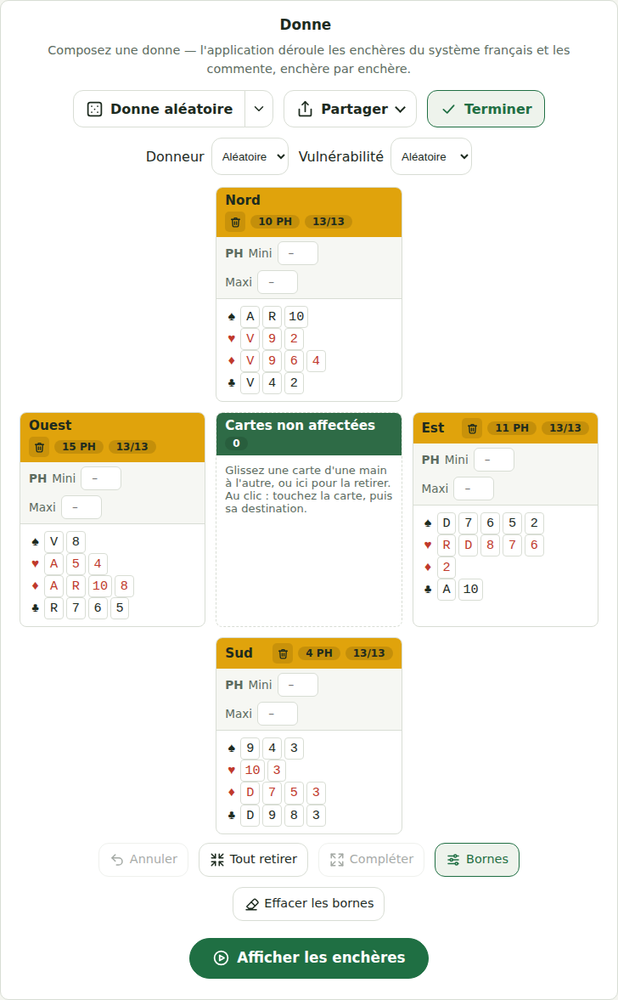
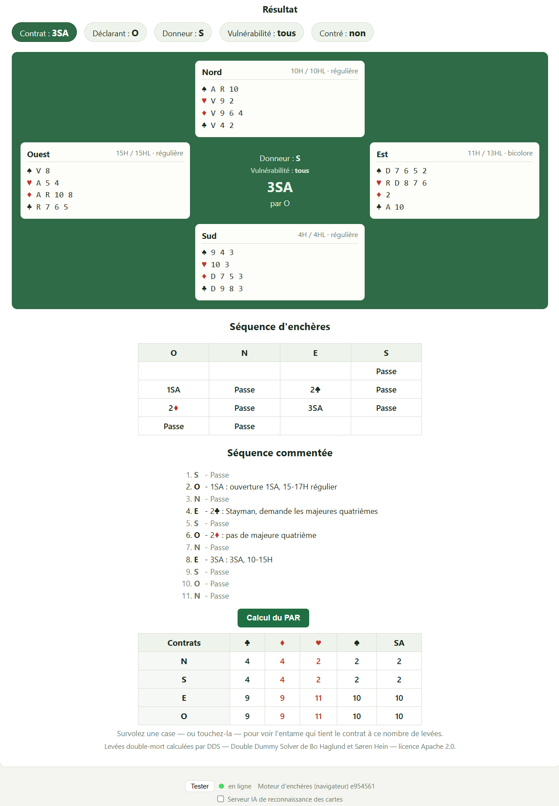

<p align="center">
  
</p>

<p align="center">
  
</p>

# Bridge Bidding

**L'application est en ligne : <https://jeanjacquesserpoul.github.io/encheres-bridge/>**

Application web qui simule la séquence d'enchères complète d'une donne de bridge, selon le système français d'enchères (SEF), et la commente enchère par enchère ; un questionnaire permet de s'entraîner à enchérir à la place d'un joueur. Les donnes s'échangent au format **PBN** (voir [docs/pbn.txt](docs/pbn.txt)).

Le moteur d'enchères, écrit en Go, est compilé en **WebAssembly** et tourne entièrement dans le navigateur : rien n'est installé, aucun serveur n'est interrogé. La page est publiée sur GitHub Pages à chaque poussée sur `main` (voir [Hébergement statique](#hébergement-statique)).

Le dépôt contient quatre morceaux :

| | Quoi | Où |
|---|------|-----|
| **Le moteur d'enchères** | bibliothèque Go sans dépendance, compilée en WebAssembly (`cli/bids.wasm`) par son point d'entrée [wasm/](wasm/) | [engine/](engine/) |
| **Le client web** | composition de la donne, enchères commentées, questionnaire, calcul du PAR — des fichiers statiques, moteur compris | [cli/](cli/) |
| **Le serveur IA** *(facultatif)* | lecture des cartes sur une photo, par un modèle de vision derrière un proxy Go | [server_ai/](server_ai/) |
| **L'audit du par** *(outil de développement)* | fait jouer un lot de donnes au moteur, compare au par double-mort, publie un rapport HTML | [tools/par/](tools/par/) |

Les règles réellement appliquées par le moteur sont décrites, une par une et avec leurs seuils, dans **[docs/regles_moteur.md](docs/regles_moteur.md)**.

---

## Démarrage

Il y a deux façons d'utiliser l'application. Dans les deux cas, c'est **la même page** et le moteur d'enchères tourne **dans le navigateur** (`cli/bids.wasm`) : les séquences, les commentaires, le questionnaire et le PAR sont identiques.

| | 1. En local avec `run.ps1` / `run.sh` | 2. Copie de `cli/` sur un hébergeur statique |
|---|---|---|
| **Pour qui** | développer, tester une modification du moteur ou du client | mettre l'application en ligne, ou l'utiliser sans rien installer |
| **Prérequis** | [Go](https://go.dev/dl/) et une copie du dépôt | aucun : un hébergeur de fichiers (GitHub Pages, Netlify…) |
| **Ce qui tourne** | un mini-serveur de fichiers ([serve/](serve/)) qui sert `cli/` sur `http://localhost:9015/` | rien d'autre que des fichiers statiques |
| **Moteur utilisé** | compilé depuis vos sources locales | celui versionné dans `cli/`, tenu à jour sur `main` |

L'application publiée par ce dépôt suit la méthode 2 : **<https://jeanjacquesserpoul.github.io/encheres-bridge/>**.

### Méthode 1 — En local avec `run.ps1` ou `run.sh`

Récupérez le dépôt, puis lancez le script de votre système depuis sa racine :

```bash
git clone https://github.com/JeanJacquesSerpoul/encheres-bridge.git
cd encheres-bridge
```

| Système | Commande |
|---|---|
| **Windows** (PowerShell) | `.\run.ps1` |
| **Linux**, WSL, Git Bash | `./run.sh` |
| **macOS** | double-clic sur [run-macos.command](run-macos.command) dans le Finder, ou `./run-macos.command` dans un terminal |

Le script :

1. recompile le moteur WebAssembly (`cli/bids.wasm`) **s'il manque**, ou avec `-f` — il est versionné, ce n'est donc utile qu'après une modification du code Go ;
2. compile le mini-serveur [serve/](serve/) dans `./bids` ou `./bids.exe` (ignorés par git) : un simple serveur de fichiers, qui pose en plus les en-têtes COOP/COEP qu'attend le calcul du PAR ;
3. le lance sur `cli/`, attend que la page réponde, puis ouvre **http://localhost:9015/** dans le navigateur.

`Ctrl+C` arrête le serveur. Si un serveur répond déjà sur le port, la page est simplement ouverte. Les fichiers de `cli/` sont lus sur le disque à chaque requête : une modification du client se voit en rechargeant la page.

```bash
./run.sh -p 9200    # autre port            (.\run.ps1 -Port 9200)
./run.sh -n         # ne pas ouvrir le navigateur   (-NoBrowser)
./run.sh -f         # recompiler cli/bids.wasm au passage   (-ForceWasm)
```

**macOS** : `run-macos.command` délègue à `run.sh` et en accepte les options. Prérequis : Go (<https://go.dev/dl/> ou `brew install go`). Au premier lancement, macOS peut bloquer un script téléchargé : clic droit › **Ouvrir**, puis confirmer. Si le fichier a perdu son droit d'exécution (archive ZIP), `chmod +x run-macos.command` le lui rend.

À la main, sans les scripts :

```bash
./build-wasm.sh              # seulement après une modification du code Go (ou .\build-wasm.ps1)
go run ./serve               # sert cli/ sur http://localhost:9015/
go run ./serve -port 8080    # autre port (ou PORT=8080)
```

### Méthode 2 — Copie de `cli/` sur un hébergeur statique

Le dossier [cli/](cli/) est l'application complète : dix fichiers, moteur d'enchères compris. Aucun serveur Go, aucune compilation, aucune configuration.

**1. Récupérer `cli/`** depuis GitHub : bouton **Code › Download ZIP** puis extraire le dossier `cli/`, ou `git clone` comme ci-dessus.

**2. Le publier**, par exemple :

- **GitHub Pages** — c'est ce que fait ce dépôt. Dans votre copie (fork) : *Paramètres › Pages › Source : **GitHub Actions***. Le workflow [pages.yml](.github/workflows/pages.yml) publie alors `cli/` à chaque poussée sur `main`, à l'adresse `https://<compte>.github.io/<dépôt>/`.
- **Netlify** — sans compte Git : glissez le dossier `cli/` sur <https://app.netlify.com/drop>. Relié au dépôt : *Build command* vide, *Publish directory* `cli`.
- **Tout autre serveur de fichiers** (Cloudflare Pages, nginx, Apache, S3…) : déposez le contenu de `cli/`, à la racine du site ou dans un sous-répertoire — tous les chemins sont relatifs.

**3. Ouvrir l'adresse du site.** Au premier chargement, la page se recharge une fois d'elle-même : c'est [cli/coi-serviceworker.js](cli/coi-serviceworker.js) qui active ce dont le calcul du PAR a besoin.

Pour essayer la copie sur votre machine, n'importe quel petit serveur web convient :

```bash
python -m http.server 8123 --directory cli   # puis http://localhost:8123/
```

> ⚠️ Ouvrir `cli/index.html` par un double-clic (`file://`) ne suffit pas : le navigateur refuse alors de charger le moteur WebAssembly. Il faut passer par un serveur, même local.

Les réglages recommandés du serveur (type MIME du `.wasm`, compression, cache) et des exemples de configuration nginx, Apache et Caddy sont détaillés dans [Hébergement statique](#hébergement-statique).

## Hébergement statique

Le client se suffit à lui-même : le moteur tourne dans le navigateur (`cli/bids.wasm`), aucun service n'est interrogé. `cli/` est donc publiable tel quel sur n'importe quel hébergeur de fichiers statiques — sans serveur Go, sans base, sans configuration.

### GitHub Pages

[.github/workflows/pages.yml](.github/workflows/pages.yml) le publie sur **GitHub Pages** à chaque poussée sur `main`, et à la demande depuis l'onglet *Actions*. Le workflow :

1. lance `go test ./...` — le moteur WebAssembly *est* ce code Go, un test rouge signifierait des enchères fausses ;
2. recompile `cli/bids.wasm` et `cli/wasm_exec.js` avec [build-wasm.sh](build-wasm.sh) : ils sont versionnés, mais le site publié ne dépend ainsi que des sources Go de `main` ;
3. vérifie qu'aucun fichier de `cli/` ne manque, puis publie le dossier.

Le site est servi sous **<https://jeanjacquesserpoul.github.io/encheres-bridge/>**. Tous les chemins du client sont relatifs, ce sous-répertoire ne demande donc aucun réglage.

**À faire une fois**, sur un nouveau dépôt : activer Pages dans *Paramètres > Pages*, avec **Source : GitHub Actions**. Le workflow ne peut pas s'en charger — créer le site demande des droits d'administration que le `GITHUB_TOKEN` n'a pas, et l'étape `configure-pages` échoue alors sur « Resource not accessible by integration ».

**Ce qu'un bon hébergeur statique apporte**, et qu'il faut vérifier ailleurs que sur Pages :

| Attendu | Pourquoi |
|---|---|
| `Content-Type: application/wasm` sur `.wasm` | Sans lui, `WebAssembly.instantiateStreaming` est refusé et le client retombe sur `arrayBuffer()`, plus lent et plus gourmand en mémoire |
| Compression (`gzip`/`br`) sur `.wasm` | 4,5 Mo bruts contre ~1,2 Mo compressés |
| `Cache-Control` sur les assets | Sans lui, chaque visite revalide tous les fichiers |

Un point reste hors de portée sur Pages, qui ne permet pas d'en-têtes personnalisés : `COOP`/`COEP`, nécessaires à `SharedArrayBuffer` donc au bouton **Calcul du PAR**. [cli/coi-serviceworker.js](cli/coi-serviceworker.js) les fournit à sa place, au prix d'**un rechargement de page à la première visite**. C'est précisément ce pour quoi il est là.

### Un autre hébergeur statique

Rien n'attache le client à GitHub Pages. N'importe quel serveur de fichiers convient — Netlify, Cloudflare Pages, un nginx, un Apache mutualisé, un bucket S3 derrière un CDN.

**1. Rien à compiler.** `cli/bids.wasm` et `cli/wasm_exec.js` sont versionnés : une copie de `cli/` depuis GitHub est complète. Le workflow [wasm.yml](.github/workflows/wasm.yml) les recompile et les recommite dès que les sources Go changent sur `main`. Pour un moteur tiré de sources locales modifiées, recompilez-les vous-même :

```bash
./build-wasm.sh          # ou .\build-wasm.ps1 sous Windows
```

**2. Copier `cli/` en entier.** Ces dix fichiers, et rien d'autre : ni le code Go, ni `server/`, ni `docs/`.

| Fichier | Taille | gzip | |
|---|---:|---:|---|
| `index.html` | 20 Ko | 6 Ko | |
| `style.css` | 30 Ko | 9 Ko | |
| `app.js` | 105 Ko | 34 Ko | l'interface |
| `par.js` | 19 Ko | 7 Ko | le tableau du PAR |
| `bids-wasm.js` | 6 Ko | 3 Ko | charge le moteur |
| `coi-serviceworker.js` | 6 Ko | 2 Ko | repli COOP/COEP |
| `bids.wasm` | **4,3 Mo** | **1,2 Mo** | **généré** — le moteur d'enchères |
| `wasm_exec.js` | 17 Ko | 4 Ko | **généré** — glue Go |
| `dds_web_wasm_bin.js` | 701 Ko | 222 Ko | solveur double-mort |
| `dds_web_wasm.js` | 193 Ko | 54 Ko | glue du solveur |

Tous les chemins du client sont **relatifs** : le dossier se dépose à la racine du site comme dans un sous-répertoire, sans rien à régler.

**3. Vérifier trois réglages du serveur.** Ils ne cassent rien s'ils manquent, mais le coût est net — les chiffres ci-dessous viennent d'un hébergement réel où ils manquaient tous les trois.

| Réglage | Sans lui |
|---|---|
| `Content-Type: application/wasm` sur `.wasm` | `WebAssembly.instantiateStreaming` est refusé ; le client retombe sur `arrayBuffer()`, plus lent et plus gourmand en mémoire |
| Compression `gzip`/`br` sur `.wasm` | 4,3 Mo transmis au lieu de 1,2 Mo |
| `Cache-Control` sur les fichiers | chaque visite revalide les dix fichiers, une requête complète chacun |

**4. Servir en HTTPS.** Un service worker n'est enregistré que dans un contexte sécurisé (HTTPS, ou `localhost`). En `http://` ou en `file://`, `coi-serviceworker.js` ne démarre pas : tout fonctionne, sauf le bouton **Calcul du PAR**, qui exige `SharedArrayBuffer`.

**5. Facultatif — poser `COOP`/`COEP`.** Si vous maîtrisez les en-têtes, ces deux lignes rendent le service worker inutile et **évitent le rechargement de page à la première visite** :

```
Cross-Origin-Opener-Policy: same-origin
Cross-Origin-Embedder-Policy: require-corp
```

#### Exemples de configuration

```nginx
# nginx
location / {
    root /var/www/bridge;          # le contenu de cli/
    types { application/wasm wasm; }   # inutile depuis nginx 1.21.5
    gzip_static on;                # sert bids.wasm.gz au lieu de comprimer
    add_header Cache-Control "public, max-age=300";
    add_header Cross-Origin-Opener-Policy   "same-origin";
    add_header Cross-Origin-Embedder-Policy "require-corp";
}
```

`gzip_static` veut un fichier déjà comprimé à côté de l'original — à préparer une fois, au déploiement. Comprimer 4,3 Mo à chaque requête coûterait plus cher que l'économie :

```bash
gzip -9 -k /var/www/bridge/bids.wasm   # produit bids.wasm.gz
```

```apache
# Apache — .htaccess déposé dans le dossier
AddType application/wasm .wasm
AddOutputFilterByType DEFLATE application/wasm application/javascript text/css text/html
Header set Cache-Control "public, max-age=300"
Header set Cross-Origin-Opener-Policy   "same-origin"
Header set Cross-Origin-Embedder-Policy "require-corp"
```

```caddy
# Caddy — compression et type MIME sont déjà corrects par défaut
bridge.exemple.net {
    root * /var/www/bridge
    file_server
    encode gzip zstd
    header Cross-Origin-Opener-Policy   "same-origin"
    header Cross-Origin-Embedder-Policy "require-corp"
}
```

**Caddy, dans un sous-répertoire d'un site existant.** Pour servir l'application sous `https://<domaine>/bridgequizz/`, à côté d'autres routes du même site, `cli/` est copié tel quel dans `/home/html/bridgequizz`, et ces lignes s'ajoutent au bloc du site dans le Caddyfile :

```caddy
redir /bridgequizz /bridgequizz/

handle_path /bridgequizz* {
     root /home/html/bridgequizz
     try_files {path} /index.html
     file_server
}
```

- **`redir` est indispensable.** `index.html` désigne ses fichiers par des chemins relatifs (`style.css`, `app.js`, `bids.wasm`…). Ouverte en `/bridgequizz` sans `/` final, la page les demanderait à la racine du site — `/style.css` au lieu de `/bridgequizz/style.css` —, hors de ce bloc : ils tomberaient dans une autre route du site, et la page resterait bloquée sur « Chargement de l'application… » (erreurs **502** si cette route est un `reverse_proxy` vers un service arrêté, **404** sinon). La redirection ajoute le `/` avant tout chargement.
- **`handle_path`** retire le préfixe `/bridgequizz` avant de chercher le fichier : `/bridgequizz/app.js` devient `/home/html/bridgequizz/app.js`.
- Facultatif, dans le bloc `handle_path` : `encode gzip zstd` pour transmettre `bids.wasm` compressé (1,2 Mo au lieu de 4,3), et les deux en-têtes `Cross-Origin-*` de l'exemple précédent pour épargner à la première visite le rechargement de [cli/coi-serviceworker.js](cli/coi-serviceworker.js).

#### Vérifier un déploiement

```bash
# Le type MIME et la compression du moteur
curl -sI -H 'Accept-Encoding: gzip' https://exemple.net/bids.wasm | grep -i 'content-type\|content-encoding\|cache-control'
# Attendu : application/wasm, gzip (ou br), et un Cache-Control

# L'isolation cross-origine, si vous avez posé les en-têtes
curl -sI https://exemple.net/ | grep -i cross-origin
```

Dans la page, la console dit le reste : `COOP/COEP Service Worker registered` puis `Reloading page…` signale que le repli a dû s'enclencher, donc que les en-têtes manquent.

## Le client web

Le client HTML+JS de [cli/](cli/) — aucune étape de build, aucun paquet npm — calcule les enchères **dans le navigateur** (voir [Le moteur dans la page](#le-moteur-dans-la-page)). Il est servi en local par `run.ps1` / `run.sh` (**http://localhost:9015/**) ou publié tel quel sur un hébergeur statique : il se comporte à l'identique dans les deux cas (voir [Démarrage](#démarrage)).

**Au premier lancement**, un écran d'accueil propose de **consulter l'aide** ou de **continuer sans l'aide** ; il ne revient plus ensuite.

**Le bandeau** porte la langue (`fr`/`en`, initialisée d'après le navigateur), le thème (automatique, clair ou sombre) et le bouton **?** du **mode d'emploi** : une aide en ligne, en français ou en anglais selon la langue choisie, qui reprend les icônes des boutons. Tout ce qui touche au serveur IA tient à une case à cocher, **décochée par défaut**, reléguée au pied de page (voir [Reconnaissance des cartes par photo](#reconnaissance-des-cartes-par-photo-serveur-ia)) ; tant qu'elle est décochée, ni la barre du serveur IA, ni les boutons appareil photo, ni son état n'apparaissent.

### Composer la donne

- La rangée du haut, en icônes (le nom de chacune est dans son infobulle), dans l'ordre : **Charger un fichier .pbn**, **Donne aléatoire**, **Donne exemple**, **Sauver le PBN**, **Texte de la donne (format PBN)** et **Copier le lien**. Un fichier de tournoi (plusieurs `[Board]`) fait apparaître un sélecteur **Donne à utiliser**.
- **Texte de la donne (format PBN)** (icône `</>`) affiche ou masque, sous la rangée, la donne écrite au format PBN ; le bouton reste enfoncé tant que le texte est affiché. On peut y coller une donne reçue par courriel — le tableau de cartes suit —, la corriger à la main, ou la copier d'un clic avec la petite icône en bas à droite du texte. Pendant un questionnaire, le texte est masqué avec la donne et le bouton est grisé.
- **Copier le lien** copie une adresse qui porte la donne dans son fragment (`#pbn=…`, jamais envoyé au serveur) : qui l'ouvre retrouve la donne — masquée s'il a activé le mode questionnaire —, puis l'adresse redevient celle de la page.
- **Donne aléatoire** tire une donne complète ; **Donneur** et **Vulnérabilité** se choisissent ou se tirent au sort. Un fichier chargé impose les siens jusqu'au prochain tirage.
- **À la première visite**, la table est vide : les 52 cartes attendent dans la zone **Cartes non affectées**. Ensuite, la **dernière donne complète** (quatre mains de 13 cartes) est retenue dans le navigateur et revient à chaque ouverture de la page — jamais la donne exemple, qui n'est qu'à un clic.
- **Composer à la main** : chaque carte se glisse d'une main à l'autre ou vers **Cartes non affectées** ; au doigt, on touche la carte puis sa destination ; au clavier, Tab passe d'une main à l'autre, les flèches parcourent les cartes, Entrée ou Espace prend puis dépose, Échap repose. Le tag `[Deal]` est réécrit à chaque déplacement. Sur écran étroit (téléphone), la zone **Cartes non affectées** reste épinglée en haut de l'écran pendant qu'on fait défiler les mains.
- Chaque main porte deux **bornes de points d'honneur** (mini/maxi), repliées par défaut : le bouton **Bornes de points** sous la table les affiche (un message d'erreur sur les bornes les rouvre de lui-même). Elles contraignent le tirage aléatoire et la distribution automatique, et signalent en rouge les mains hors bornes.
- Sous la table : **Annuler** (ou **Ctrl+Z**) revient sur la dernière action qui a changé la donne — déplacement, poubelle, table vidée ou complétée, photo, nouvelle donne tirée, exemple ou fichier chargé (50 étapes au plus, le temps de la visite) ; **Retirer toutes les cartes** vide la table, **Compléter les mains** répartit les cartes non affectées entre les mains incomplètes en respectant les bornes (grisé quand il n'y a rien à distribuer), **Effacer les bornes** remet les mini/maxi à vide, **Afficher les enchères** lance le calcul. L'en-tête de chaque main porte une **poubelle** qui renvoie ses seules cartes au centre.

### Voir les enchères

**Afficher les enchères** calcule la séquence dans la page et affiche, dans le panneau **Résultat** placé juste sous la donne (**Revenir à la donne** y remonte ; l'icône d'imprimante l'imprime seul, en thème clair), les quatre mains autour de la table avec le contrat, la grille d'enchères (survolez ou touchez une enchère pour lire sa signification) et la séquence commentée.

### Le moteur dans la page

Le moteur Go ([engine/](engine/)) est compilé en **WebAssembly** par [build-wasm.sh](build-wasm.sh) : son point d'entrée [wasm/main.go](wasm/main.go) produit `cli/bids.wasm` (versionné, ~4,5 Mo, ~1,2 Mo sur le réseau une fois compressé). Le client le précharge dès l'ouverture de la page ([cli/bids-wasm.js](cli/bids-wasm.js)), hors du chemin critique de l'affichage, et calcule les enchères sur place : aucune requête, et l'application fonctionne hors ligne une fois chargée.

La pastille d'état du pied de page rejoue une donne de référence au chargement et nomme la révision du moteur (une étoile signale un moteur compilé sur un dépôt modifié). Si le moteur ne se charge pas — fichier absent, page ouverte en `file://`, navigateur sans WebAssembly —, la raison s'affiche au pied de page : sans lui, rien ne peut être calculé.

### Le questionnaire

Le panneau **Questionnaire d'enchères**, sous celui de la donne, choisit **votre main** (Nord, Est, Sud ou Ouest) et lance l'entraînement sur la donne composée.

- **Seule votre main est visible.** La donne composée au-dessus — les quatre mains, le texte PBN et les boutons sous la table — est masquée, remplacée par la ligne « Donne masquée. **Afficher la donne** » ; ce lien la montre à tout moment.
- Les enchères des trois autres sièges **s'enchaînent d'elles-mêmes** (une toutes les 0,7 s), chacune brièvement surlignée à son arrivée dans la grille.
- À votre tour, une **boîte à enchères** n'ouvre que les enchères **légales** (palier suffisant, contre et surcontre selon le camp du dernier appelant). La réponse est comparée à celle du moteur : verdict, enchère attendue et son commentaire SEF, puis **Continuer**. Après une mauvaise réponse, **Voir l'arbre de décision** déplie le chemin suivi par le moteur sur la main — chaque règle examinée dans l'ordre, ✓ ou ✗, avec la valeur mesurée —, pour l'instant sur les ouvertures et les réponses sans intervention adverse (voir le champ `trace` ci-dessous) ; le même lien figure dans le récapitulatif de fin.
- **Annuler** arrête le questionnaire à tout moment et revient au panneau de la donne.
- À la fin, les mains sont dévoilées dans le questionnaire, le score s'affiche (`n / total`, en pourcentage) avec le contrat final, et trois suites sont offertes : **Rejouer cette donne**, **Nouvelle donne**, **Afficher le détail complet**. La donne composée, elle, **reste masquée** : le lien **Afficher la donne** la rend.

**Mode questionnaire** : un interrupteur sous le choix de la main, mémorisé dans le navigateur. Activé, il fait arriver **masquée** chaque nouvelle donne — tirage, donne exemple, fichier, choix dans un fichier multi-donnes, donne retrouvée à l'ouverture de la page — pour s'entraîner sur une donne que l'on ne connaît pas. **Afficher la donne** la montre ; déplacer ensuite une carte ne la re-masque pas. Désactivé, la donne s'affiche normalement et n'est masquée que pendant un questionnaire.

### Ce que le navigateur retient

Rien n'est envoyé nulle part : ces réglages vivent dans le `localStorage` du navigateur, propre à chaque adresse (une copie sur GitHub Pages et `localhost:9015` ne partagent donc rien).

| Clé | Contenu |
|---|---|
| `bids.lang`, `bids.theme` | Langue et thème |
| `bids.quizMode` | Mode questionnaire activé ou non |
| `bids.lastDeal` | Dernière donne complète (bloc PBN), rechargée à l'ouverture |
| `bids.welcomed` | Écran d'accueil déjà vu : il ne s'affiche qu'au premier lancement |
| `ia.enabled`, `ia.mode`, `ia.local`, `ia.remote` | Option de reconnaissance par photo et serveur IA visé |

### Le PAR

Sous les commentaires, **Calcul du PAR** donne les levées double-mort de chaque camp dans chaque couleur, calculées dans le navigateur par le solveur DDS compilé en WebAssembly ([cli/par.js](cli/par.js)). Chaque case porte son entame : survolez-la — ou touchez-la, l'entame s'affiche alors en bandeau bas — et le solveur reprend la donne pour lister les cartes de l'entameur qui tiennent le déclarant à ce chiffre, ainsi que ce que coûtent les autres. Quand presque toutes les entames se valent, c'est la courte liste de celles qui lâchent une levée qui s'affiche.

### Reconnaissance des cartes par photo (serveur IA)

Une fois cochée l'option **Serveur IA de reconnaissance des cartes**, au pied de page, le client sait remplir la donne à partir d'une photo, comme l'application *bridgeteacher* dont il reprend les prompts. La lecture est faite par un modèle de vision, interrogé à travers le **serveur IA** de [server_ai/](server_ai/) — un serveur Go autonome, repris d'aiproxy et réduit au seul fournisseur OpenRouter, qui expose `POST /api/chat` (`{ text, model, image }` → `{ success, response }`) et `GET /health`, garde la clé d'API hors du navigateur et envoie les en-têtes CORS voulus (le client et lui n'ont pas la même origine en développement).

- **Bouton appareil photo de la ligne d'actions** : une photo des quatre mains disposées en croix (Nord en haut, Sud en bas, Ouest à gauche, Est à droite). Les cartes lues refont la donne entière ; celles que la photo n'a pas livrées attendent dans la zone non affectée, où **Compléter les mains** les distribue.
- **Appareil photo d'un en-tête de main** : une photo des cartes d'une seule main. Elles deviennent cette main ; les cartes qu'elle détenait repartent en zone non affectée, et celles qu'un autre siège détenait lui sont retirées — une carte n'est jamais à deux endroits.
- Sur mobile, le bouton ouvre directement la caméra arrière (`capture="environment"`) ; la photo est réduite à 2560 px et redressée selon l'orientation de l'appareil avant l'envoi.
- **Recadrage et rotation.** La photo passe ensuite par un éditeur, avant tout envoi : deux boutons la font tourner d'un quart de tour dans un sens ou dans l'autre — l'orientation relevée par l'appareil ne redresse pas une photo prise à plat sur la table — et un glissement sur l'image y trace le rectangle à lire, que huit poignées ajustent et qu'un glissement à l'intérieur déplace. Le rectangle suit les rotations, **Image entière** le rouvre en grand, **Annuler** abandonne la photo. Seule la zone retenue part au serveur : le décor autour des cartes coûtait au modèle des cartes lues.
- Les figures écrites dans une autre langue (R/D/V) sont converties par le modèle lui-même. Un rang illisible, une carte en double ou une main déjà pleine sont écartés, et le compte rendu affiché à côté du bouton le dit.

Le serveur IA se choisit dans l'en-tête, sous celui des enchères, avec les mêmes règles : **Local** vise `http://localhost:9009` (son port par défaut), **Distant** attend l'URL du déploiement — par exemple `https://<domaine>/aiproxy` derrière Caddy ; mode et URL sont mémorisés (`localStorage`). Son état est sondé comme celui du serveur d'enchères et affiché sous lui dans le pied de page. **Tant qu'il ne répond pas, les boutons photo restent désactivés** : le reste du client, lui, fonctionne sans lui. Mise en route et configuration : [server_ai/README.md](server_ai/README.md).

---

## Tests

```bash
go test ./...
```

Environ 140 fichiers de tests couvrent le parseur PBN (rotation des mains, validation des 13 cartes, doublons, fuzz), le JSON que le moteur rend à la page ([engine/api_test.go](engine/api_test.go)) et, surtout, les règles du moteur convention par convention — un fichier par sujet (`drury_test.go`, `landy_test.go`, `reveil_test.go`, `fourth_suit_forcing_test.go`...). Un test de cohérence soumet 2 000 donnes aléatoires au moteur pour vérifier que chaque séquence est légale (enchères suffisantes, contres valides, rotation des joueurs) et se termine. Des donnes d'exemple sont fournies dans [engine/testdata/](engine/testdata/).

Trois fichiers ne sont pas des assertions mais des **harnais** : `audit_soft_test.go` et `audit_detail_test.go` publient des statistiques (manches manquées, chelems minces, trous par forme d'enchère) sans jamais échouer, et `audit_par_test.go` alimente l'audit ci-dessous.

## Audit du par

Les tests disent si une enchère est *légale* ; l'audit dit si elle est *bonne*. Il tire un lot de donnes, fait jouer l'enchère complète par le moteur, calcule le **par** de chaque donne en double-mort avec le solveur DDS du client, et publie un rapport HTML qui isole les écarts.

```bash
tools/par/run.sh              # 1 000 donnes, graine 20260906
tools/par/run.sh 5000 42      # 5 000 donnes, graine 42
```

```powershell
tools\par\run.ps1                        # 1 000 donnes, graine 20260906
tools\par\run.ps1 -Deals 5000 -Seed 42   # 5 000 donnes, graine 42
```

Le rapport (`tools/par/out/rapport.html`) donne la vue d'ensemble — contrats tenus, marque égale au par, écart moyen en IMP, distribution des paliers — puis six listes de donnes : camp déclarant inversé, couleur différente du par, chelem demandé mais impossible, chelem manqué, manche demandée mais impossible, manche manquée. Chaque ligne se déplie sur le diagramme, la séquence et la table des levées double-mort.

À graine égale les donnes sont les mêmes, donc deux révisions du moteur se comparent ligne à ligne. Le harnais Go est ignoré tant que `PAR_AUDIT_OUT` ne désigne pas un fichier : `go test ./...` n'en voit rien. Mode d'emploi complet dans [tools/par/README.md](tools/par/README.md).

---

## Format de la réponse du moteur

Le moteur expose à la page une petite API ([engine/api.go](engine/api.go)), que [wasm/main.go](wasm/main.go) installe sous `window.bidsWasm` et que [cli/bids-wasm.js](cli/bids-wasm.js) enveloppe dans `window.bidsLocal` :

| Fonction | Rôle |
|---|---|
| `bid(pbn, lang)` | Enchères d'une donne : l'objet JSON décrit ci-dessous |
| `bids(pbn, lang)` | Même chose pour chaque donne d'un fichier de tournoi : un tableau de ces objets |
| `selfCheck()` | Rejoue une donne de référence (pastille d'état du pied de page) |
| `version()` | Révision du moteur, date du commit, version de Go |

`lang` vaut `en` (défaut) ou `fr`. Un PBN invalide ou une langue inconnue renvoient une erreur au lieu de la réponse.

### Format PBN minimal attendu

Le fichier doit contenir au minimum les tags `Dealer` et `Deal` :

```
[Dealer "N"]
[Deal "N:AKQ.KJ4.AQ54.J32 J9.AT63.K762.Q98 8762.Q987.93.A76 T543.52.JT8.KT54"]
```

Le tag `Deal` suit le format PBN standard :
`"<premier>:<main1> <main2> <main3> <main4>"` — les quatre mains dans le sens des aiguilles d'une montre à partir du siège `<premier>` (N, E, S ou W). Chaque main est donnée dans l'ordre `♠.♥.♦.♣` (rangs en ordre quelconque à l'import, `T` pour le 10, couleur vide pour une chicane). Les quatre mains sont obligatoires (pas de main `-`) et les 52 cartes doivent être présentes une seule fois.

### Réponse

Exemple réel (donne ci-dessus, `lang=fr`) :

```json
{
  "dealer": "N",
  "vulnerable": "None",
  "lang": "fr",
  "hands": {
    "N": {
      "spades":    "AKQ",
      "hearts":    "KJ4",
      "diamonds":  "AQ54",
      "clubs":     "J32",
      "hl_points": 20,
      "h_points":  20,
      "type":      "régulière"
    },
    "E": { "...": "..." },
    "S": { "...": "..." },
    "W": { "...": "..." }
  },
  "auction": [
    { "player": "N", "bid": "2SA",   "comment": "ouverture 2SA, 20-21H régulier" },
    { "player": "E", "bid": "Passe", "comment": "pas de quoi intervenir" },
    { "player": "S", "bid": "3T",    "comment": "Stayman, demande les majeures quatrièmes" },
    { "player": "W", "bid": "Passe", "comment": "pas de quoi intervenir" },
    { "player": "N", "bid": "3K",    "comment": "pas de majeure quatrième" },
    { "player": "E", "bid": "Passe", "comment": "pas de quoi intervenir" },
    { "player": "S", "bid": "3SA",   "comment": "3SA sur la force combinée" },
    { "player": "W", "bid": "Passe", "comment": "pas de quoi intervenir" },
    { "player": "N", "bid": "Passe", "comment": "l'enchère du partenaire convient, rien à ajouter" },
    { "player": "E", "bid": "Passe", "comment": "pas de quoi intervenir" }
  ],
  "contract": "3SA",
  "declarer": "N",
  "doubled": false
}
```

### Champs de la réponse

| Champ | Description |
|-------|-------------|
| `board` | Numéro de donne (tag `[Board]`), absent si non fourni |
| `dealer` | Donneur : `N`, `E`, `S` ou `W` |
| `vulnerable` | Vulnérabilité : `None`, `NS`, `EW` ou `All` |
| `lang` | Langue effective de la réponse |
| `hands.<siège>.spades/hearts/diamonds/clubs` | Cartes de la main, rangs en ordre décroissant |
| `hands.<siège>.h_points` | Points d'honneurs (A=4, R=3, D=2, V=1) |
| `hands.<siège>.hl_points` | Points H + points de longueur (1 point par carte au-delà de la 4ᵉ) |
| `hands.<siège>.type` | Type de main : `régulière`, `unicolore`, `bicolore`, `tricolore` (`en` : `regular`, `single-suited`, `two-suited`, `three-suited`) |
| `auction[].player` | Joueur : `N`, `E`, `S`, `W` (dans l'ordre, en commençant par le donneur) |
| `auction[].bid` | Enchère dans la notation de la langue demandée |
| `auction[].comment` | Signification de l'enchère dans le système SEF. **Jamais vide** : un passe que le système ne commente pas reçoit la raison que sa position garantit (voir [§1.1](docs/regles_moteur.md)) |
| `contract` | Contrat final (ex. `4P`), ou `Passe`/`Pass` si la donne est passée |
| `declarer` | Déclarant : premier joueur du camp gagnant à avoir nommé la dénomination du contrat (vide si donne passée) |
| `doubled` | `true` si le contrat final est contré (ou surcontré) |
| `auction[].trace` | Chemin de décision de l'enchère, évalué sur la main (absent tant que la situation n'est pas instrumentée — pour l'instant les ouvertures et les réponses sans intervention : 1 en majeure, 1 en mineure, 1SA, 2SA, relais sur 2♣) : liste de `{label, value, ok, note, depth}` — le test dans la langue demandée, la valeur mesurée (`"14 HL"`, `"4 ♠"`), s'il tient, s'il s'agit d'une simple note (filet de sécurité, passe final), sa profondeur d'imbrication |

### Notation des enchères

| | Trèfle | Carreau | Cœur | Pique | Sans-Atout | Passe | Contre | Surcontre |
|---|---|---|---|---|---|---|---|---|
| `en` | `C` | `D` | `H` | `S` | `NT` | `Pass` | `X` | `XX` |
| `fr` | `T` | `K` | `C` | `P` | `SA` | `Passe` | `Contre` | `Surcontre` |

---

## Moteur d'enchères (SEF)

Le moteur fait enchérir les quatre joueurs à tour de rôle, chacun avec sa seule main et les informations promises par les enchères précédentes, jusqu'à trois passes consécutives.

> **La description complète et à jour des règles est dans [docs/regles_moteur.md](docs/regles_moteur.md)** : chaque règle y porte un numéro stable — **[O-3]**, **[RM-7]**, **[C-21]**… — citable en revue, avec le seuil exact que le code applique et un **⚠** partout où il s'écarte du SEF. Le tableau ci-dessous n'est qu'une carte d'ensemble.

| Domaine | Ce que le moteur couvre | Détail |
|---------|--------------------------|--------|
| **Évaluation** | H, HL avant fit, HLD après fit (chicane 3, singleton 2, doubleton 1), belle couleur, arrêt / double arrêt / arrêt et demi, dévaluation par les enchères adverses, seuils de manche et de chelem | [§2](docs/regles_moteur.md#2-évaluation-des-mains) |
| **Ouvertures** | 1♣/1♦ (mineure la plus longue, 3-3 → 1♣, 4-4/5-5 → 1♦), 1♥/1♠ (5 cartes, 12-23 HL), 1SA (15-17 H régulier), 2SA (20-21 H), 2♣ fort indéterminé, 2♦ forcing de manche, 3SA mineure septième affranchie, 2♥/2♠ faibles, barrages 3 (7 cartes) et 4 (8 cartes), ouvertures légères de 3ᵉ et 4ᵉ | [§3](docs/regles_moteur.md#3-les-ouvertures) |
| **Réponses à 1 à la couleur** | soutiens par zones HLD (dont le 2SA fitté 11-12), splinter, 1SA « poubelle », changements de couleur forcing 1 sur 1 et 2 sur 1, majeure quatrième prioritaire sur mineure, Drury de la main déjà passée face à une ouverture de 3ᵉ ou 4ᵉ, réponses en compétition | [§4](docs/regles_moteur.md#4-réponses-aux-ouvertures-de-1-à-la-couleur) |
| **Réponses à 1SA / 2SA** | Stayman, Texas majeurs et mineurs, misère dorée, bicolore mineur fort, échelle Sans-Atout quantitative | [§5](docs/regles_moteur.md#5-réponses-à-1sa-et-2sa) |
| **Réponses aux ouvertures fortes et de barrage** | relais 2♦ sur 2♣ (2SA d'attente 0-7, scission de la zone faible sur les honneurs avec fit mineur), réponses aux As sur 2♦, réponses aux 2 faibles par zones HLD (2SA relais-fitté, attaque-défense, prolongement de barrage) | [§6](docs/regles_moteur.md#6-réponses-aux-ouvertures-fortes-et-de-barrage) |
| **Redemandes de l'ouvreur** | 1SA/2SA/3SA par zones, soutiens 12-16 / 17-19 / 20+ HLD, bicolores économique / à saut / **cher** (18 HL et plus, auto-forcing), répétitions simple et à saut, rectifications des Texas, suites de 2♣ et 2♦, réveil de l'ouvreur | [§7](docs/regles_moteur.md#7-redemandes-de-louvreur) |
| **Conventions du camp de l'ouvreur** | Checkback, Roudi à trois paliers, demande d'arrêt après répétition d'une mineure, Rubensohl, essai « couleur nécessitant un appui », **quatrième couleur forcing** (avec le 2♠ « impossible » au palier de 1) et **troisième couleur forcing** (la « collante » de l'ouverture) | [§8](docs/regles_moteur.md#8-conventions-du-camp-de-louvreur) |
| **Défense** | interventions naturelles, 1SA d'intervention 16-18, contre d'appel 12-17 et contre « toutes distributions » à partir de 18, Michaels, Landy, règle des trois zones sur le contre, cue-bid de force de l'avancée, **le réveil** et ses réponses | [§9](docs/regles_moteur.md#9-le-camp-de-la-défense) |
| **Compétition** | loi des levées totales (soutien et bataille de partielle), surenchère, sacrifice calculé sur le barème exact ([score.go](engine/score.go)), contre punitif | [§10](docs/regles_moteur.md#10-la-compétition) |
| **Chelem** | enchères de contrôle, Blackwood 4SA « cinq clefs », appel aux Rois, 4SA quantitatif, déclenchement par le compte (29-32 par contrôles, 33 direct) ou par les clefs vues | [§11](docs/regles_moteur.md#11-la-zone-de-chelem) |
| **Conclusion** | chaque joueur additionne ses points et ceux promis par le partenaire pour viser le bon palier — manche à 25 HL (SA), 27 HLD (majeure), 30 HLD (mineure), chelem à 33 — ou proposer en zone intermédiaire | [§12](docs/regles_moteur.md#12-la-décision-générique-de-fin-denchères) |

### Ce que le moteur ne fait pas

- **La vulnérabilité** (tag `[Vulnerable]`, exposée dans la réponse) n'entre que dans les décisions de sacrifice compétitif ([score.go](engine/score.go)) ; elle ne pèse nulle part ailleurs dans l'arbre de décision.
- **Les contres** sont essentiellement d'appel. Le punitif n'apparaît que dans deux situations précises : le contre d'un sacrifice adverse [L-4], et le passe qui convertit en punitif le contre Rubensohl du partenaire (arrêt et 17 H et plus) [C-17]. Il n'y a notamment **pas de contre punitif de 1SA**.
- Le moteur implémente un **sous-ensemble raisonné** du SEF, et assume des écarts. Ils sont recensés, avec ce qu'ils coûtent, dans [§14 « Points à discuter en priorité »](docs/regles_moteur.md#14-points-à-discuter-en-priorité) ; les rattrapages qui masquent un trou plutôt qu'une règle de bridge sont isolés dans [§13 « Filets de sécurité »](docs/regles_moteur.md#13-filets-de-sécurité) — leur déclenchement signale un vrai bug.

Les séquences produites restent en tout état de cause légales, terminées et commentées.

## Structure du projet

Tout le code Go est dans trois dossiers d'un même module (`go.mod`, à la racine) : [engine/](engine/), le moteur et ses tests ; [wasm/](wasm/), son point d'entrée WebAssembly ; [serve/](serve/), le mini-serveur de fichiers du lancement local. On compile et on teste depuis la racine : `go test ./...`, `./build-wasm.sh`, `go run ./serve`.

| Fichier | Rôle |
|---------|------|
| `engine/api.go` | API du moteur rendue à la page : `BidJSON`, `BidsJSON`, `SelfCheck`, `VersionJSON` |
| `engine/pbn.go` | Parseur PBN (`Board`, `Dealer`, `Vulnerable`, `Deal`) |
| `engine/cards.go` | Mains et évaluation (H/HL/HLD, types, arrêts) |
| `engine/calls.go` | Enchères, significations, notation `en`/`fr` |
| `engine/engine.go` | Boucle d'enchères, rôles, mémoire des enchères, Blackwood |
| `engine/decisions.go` | Règles SEF (ouvertures, réponses, redemandes, interventions, réveil) |
| `engine/conclude.go` | Conclusion de l'enchère : table de handlers par convention, puis décision générique (manche/proposition/chelem) |
| `engine/score.go` | Barème de marque, utilisé pour les décisions de sacrifice |
| `engine/response.go` | Forme JSON de la réponse, estampille de version, encodeur |
| `engine/*_test.go` | ~140 fichiers : parseur, API JSON, et une convention par fichier |
| `engine/audit_par_test.go`, `audit_soft_test.go`, `audit_detail_test.go` | Harnais (jamais d'échec) : export des enchères pour l'audit, statistiques |
| `engine/testdata/` | Donnes PBN d'exemple |
| `wasm/main.go` | Point d'entrée WebAssembly (`js && wasm`) : l'API du moteur exposée à la page |
| `serve/main.go` | Mini-serveur de fichiers de `run.*` : sert `cli/` avec les en-têtes COOP/COEP |
| `cli/` | Le client web : `index.html`, `app.js`, `par.js`, `bids-wasm.js`, le solveur DDS et le moteur d'enchères en WebAssembly |
| `build-wasm.sh`, `build-wasm.ps1` | Compilation du moteur en WebAssembly dans `cli/` (`bids.wasm`, `wasm_exec.js`, versionnés) |
| `run.sh`, `run.ps1`, `run-macos.command` | Lancement local : compilation au besoin, mini-serveur et ouverture du navigateur |
| `.github/workflows/pages.yml` | Publication du client sur GitHub Pages à chaque poussée sur `main` |
| `.github/workflows/wasm.yml` | Recompile et recommite `cli/bids.wasm` quand les sources Go changent sur `main` |
| `tools/par/` | Audit du moteur contre le par : levées double-mort (DDS), calcul du par, rapport HTML |
| `server_ai/` | Serveur IA de la reconnaissance des cartes par photo : module Go autonome, proxy vers OpenRouter |
| `docs/regles_moteur.md` | Description complète des règles telles qu'elles sont codées |
| `docs/pbn.txt` | Rappel du format PBN |
| `THIRD-PARTY-NOTICES.md` | Composants tiers redistribués et leurs licences |

## Licence

Ce projet est distribué sous la **licence publique générale GNU, version 3** (GPL-3.0) — voir [LICENSE](LICENSE).

Il redistribue un composant tiers sous sa propre licence : le solveur double-mort **[DDS](https://github.com/dds-bridge/dds)** de Bo Haglund et Søren Hein, compilé en WebAssembly et servi par le client à l'appui du bouton « Calcul du PAR », sous **licence Apache 2.0**. Le détail figure dans **[THIRD-PARTY-NOTICES.md](THIRD-PARTY-NOTICES.md)** ; l'application elle-même porte l'attribution sous le tableau du PAR.
