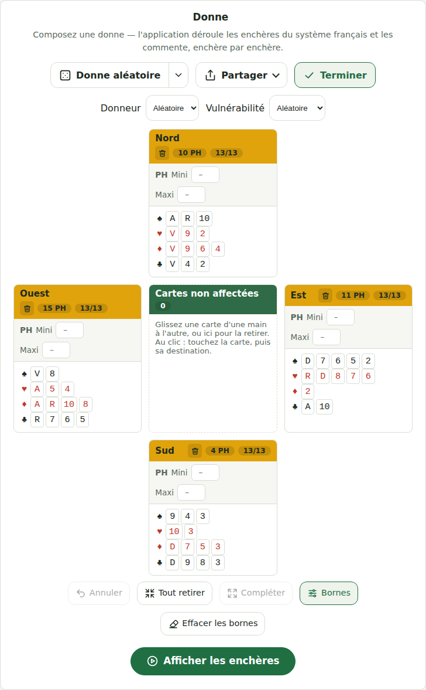
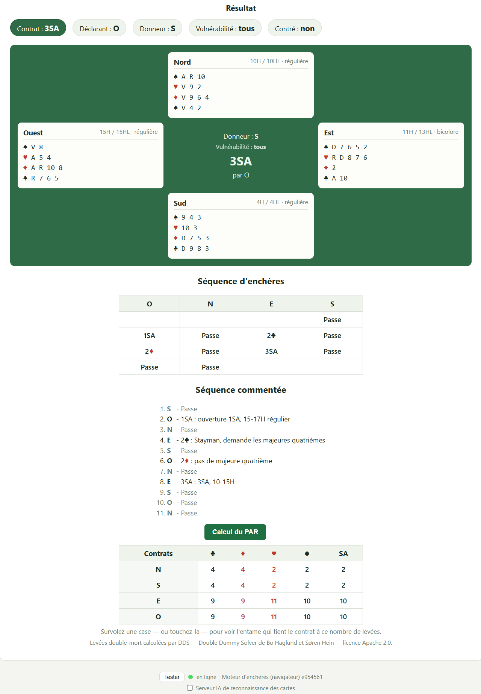

<p align="center">
  
</p>

<p align="center">
  
</p>

# Enchères au jeu de bridge

**L'application est en ligne : <https://jeanjacquesserpoul.github.io/encheres-bridge/>**

Application web qui simule la séquence d'enchères complète d'une donne de bridge, selon le système français d'enchères (SEF), et la commente enchère par enchère ; **S'entraîner** fait enchérir à la place d'un joueur, sur des donnes tirées au hasard. Les donnes s'échangent au format **PBN** (voir [docs/pbn.txt](docs/pbn.txt)).

Le moteur d'enchères, écrit en Go, est compilé en **WebAssembly** et tourne entièrement dans le navigateur : rien n'est installé, aucun serveur n'est interrogé. La page est publiée sur GitHub Pages à chaque poussée sur `main` (voir [Hébergement statique](#hébergement-statique)).

Le dépôt contient quatre morceaux :

| | Quoi | Où |
|---|------|-----|
| **Le moteur d'enchères** | bibliothèque Go qui applique les règles d'un système d'enchères écrites en YAML, compilée en WebAssembly (`cli/bids.wasm`) par son point d'entrée [wasm/](wasm/) | [engine/](engine/) |
| **Les règles d'enchères** | 1 189 règles SEF 2024 (après expansion des modèles), lues par le moteur à chaque chargement de la page : on les modifie sans recompiler. Un dossier par système, avec ses donnes thématiques | [cli/systems/](cli/systems/) |
| **Le client web** | composition de la donne, enchères commentées, entraînement, calcul du PAR — des fichiers statiques, moteur compris | [cli/](cli/) |
| **Le serveur IA** *(facultatif)* | lecture des cartes sur une photo, par un modèle de vision derrière un proxy Go | [openrouter_proxy/](openrouter_proxy/) |
| **L'audit du par** *(outil de développement)* | fait jouer un lot de donnes au moteur, compare au par double-mort, publie un rapport HTML | [tools/par/](tools/par/) |

Les règles appliquées par le moteur sont **[cli/systems/sef/rules.yaml](cli/systems/sef/rules.yaml)** (SEF 2024) ou celles d'un autre système de [cli/systems/](cli/systems/), au choix dans les Réglages : une liste ordonnée où la première règle applicable donne l'enchère. Chaque système est un dossier, avec ses règles, leur description en PDF et ses donnes thématiques. Après modification d'un système, `./update-system.sh <système>` (`.\update-system.ps1 <système>` sous Windows) régénère ses données de test et ses PDF, puis lance les tests. Comment les modifier : [cli/systems/README.md](cli/systems/README.md) ; leur sémantique exacte : [tools/python_tools/SEF_2024_spec.md](tools/python_tools/SEF_2024_spec.md).

---

## Démarrage

Il y a deux façons d'utiliser l'application. Dans les deux cas, c'est **la même page** et le moteur d'enchères tourne **dans le navigateur** (`cli/bids.wasm`) : les séquences, les commentaires, l'entraînement et le PAR sont identiques.

| | 1. En local avec `run.ps1` / `run.sh` | 2. Copie de `cli/` sur un hébergeur statique |
|---|---|---|
| **Pour qui** | développer, tester une modification du moteur ou du client | mettre l'application en ligne, ou l'utiliser sans rien installer |
| **Prérequis** | [Go](https://go.dev/dl/) et une copie du dépôt | aucun : un hébergeur de fichiers (GitHub Pages, Netlify…) |
| **Ce qui tourne** | un mini-serveur de fichiers ([serve/](serve/)) qui sert `cli/` sur `http://localhost:9015/` | rien d'autre que des fichiers statiques |
| **Moteur utilisé** | compilé depuis vos sources locales | celui versionné dans `cli/`, tenu à jour sur `main` |

L'application publiée par ce dépôt suit la méthode 2 : **<https://jeanjacquesserpoul.github.io/encheres-bridge/>**.

### Méthode 1 — En local avec `run.ps1` ou `run.sh`

Récupérez le dépôt, puis lancez le script de votre système depuis sa racine :

```bash
git clone https://github.com/JeanJacquesSerpoul/encheres-bridge.git
cd encheres-bridge
```

| Système | Commande |
|---|---|
| **Windows** (PowerShell) | `.\run.ps1` |
| **Linux**, WSL, Git Bash | `./run.sh` |
| **macOS** | double-clic sur [run-macos.command](run-macos.command) dans le Finder, ou `./run-macos.command` dans un terminal |

Le script :

1. recompile le moteur WebAssembly (`cli/bids.wasm`) **s'il manque**, ou avec `-f` — il est versionné, ce n'est donc utile qu'après une modification du code Go ;
2. compile le mini-serveur [serve/](serve/) dans `./bids` ou `./bids.exe` (ignorés par git) : un simple serveur de fichiers, qui pose en plus les en-têtes COOP/COEP qu'attend le calcul du PAR ;
3. le lance sur `cli/`, attend que la page réponde, puis ouvre **http://localhost:9015/** dans le navigateur.

`Ctrl+C` arrête le serveur. Si un serveur répond déjà sur le port, la page est simplement ouverte. Les fichiers de `cli/` sont lus sur le disque à chaque requête : une modification du client se voit en rechargeant la page.

```bash
./run.sh -p 9200    # autre port            (.\run.ps1 -Port 9200)
./run.sh -n         # ne pas ouvrir le navigateur   (-NoBrowser)
./run.sh -f         # recompiler cli/bids.wasm au passage   (-ForceWasm)
```

**macOS** : `run-macos.command` délègue à `run.sh` et en accepte les options. Prérequis : Go (<https://go.dev/dl/> ou `brew install go`). Au premier lancement, macOS peut bloquer un script téléchargé : clic droit › **Ouvrir**, puis confirmer. Si le fichier a perdu son droit d'exécution (archive ZIP), `chmod +x run-macos.command` le lui rend.

À la main, sans les scripts :

```bash
./build-wasm.sh              # seulement après une modification du code Go (ou .\build-wasm.ps1)
go run ./serve               # sert cli/ sur http://localhost:9015/
go run ./serve -port 8080    # autre port (ou PORT=8080)
```

### Méthode 2 — Copie de `cli/` sur un hébergeur statique

Le dossier [cli/](cli/) est l'application complète : onze fichiers et le dossier `systems/`, moteur d'enchères et règles compris. Aucun serveur Go, aucune compilation, aucune configuration.

**1. Récupérer `cli/`** depuis GitHub : bouton **Code › Download ZIP** puis extraire le dossier `cli/`, ou `git clone` comme ci-dessus.

**2. Le publier**, par exemple :

- **GitHub Pages** — c'est ce que fait ce dépôt. Dans votre copie (fork) : *Paramètres › Pages › Source : **GitHub Actions***. Le workflow [pages.yml](.github/workflows/pages.yml) publie alors `cli/` à chaque poussée sur `main`, à l'adresse `https://<compte>.github.io/<dépôt>/`.
- **Netlify** — sans compte Git : glissez le dossier `cli/` sur <https://app.netlify.com/drop>. Relié au dépôt : *Build command* vide, *Publish directory* `cli`.
- **Tout autre serveur de fichiers** (Cloudflare Pages, nginx, Apache, S3…) : déposez le contenu de `cli/`, à la racine du site ou dans un sous-répertoire — tous les chemins sont relatifs.

**3. Ouvrir l'adresse du site.** Au premier chargement, la page se recharge une fois d'elle-même : c'est [cli/coi-serviceworker.js](cli/coi-serviceworker.js) qui active ce dont le calcul du PAR a besoin.

Pour essayer la copie sur votre machine, n'importe quel petit serveur web convient :

```bash
python -m http.server 8123 --directory cli   # puis http://localhost:8123/
```

> ⚠️ Ouvrir `cli/index.html` par un double-clic (`file://`) ne suffit pas : le navigateur refuse alors de charger le moteur WebAssembly. Il faut passer par un serveur, même local.

Les réglages recommandés du serveur (type MIME du `.wasm`, compression, cache) et des exemples de configuration nginx, Apache et Caddy sont détaillés dans [Hébergement statique](#hébergement-statique).

## Hébergement statique

Le client se suffit à lui-même : le moteur tourne dans le navigateur (`cli/bids.wasm`), aucun service n'est interrogé. `cli/` est donc publiable tel quel sur n'importe quel hébergeur de fichiers statiques — sans serveur Go, sans base, sans configuration.

### GitHub Pages

[.github/workflows/pages.yml](.github/workflows/pages.yml) le publie sur **GitHub Pages** à chaque poussée sur `main`, et à la demande depuis l'onglet *Actions*. Le workflow :

1. lance `go test ./...` — le moteur WebAssembly *est* ce code Go, un test rouge signifierait des enchères fausses ;
2. recompile `cli/bids.wasm` et `cli/wasm_exec.js` avec [build-wasm.sh](build-wasm.sh) : ils sont versionnés, mais le site publié ne dépend ainsi que des sources Go de `main` ;
3. vérifie qu'aucun fichier de `cli/` ne manque — y compris, pour chaque système de `cli/systems/index.json`, ses règles, ses PDF et les donnes thématiques qu'il déclare —, puis publie le dossier.

Le site est servi sous **<https://jeanjacquesserpoul.github.io/encheres-bridge/>**. Tous les chemins du client sont relatifs, ce sous-répertoire ne demande donc aucun réglage.

**À faire une fois**, sur un nouveau dépôt : activer Pages dans *Paramètres > Pages*, avec **Source : GitHub Actions**. Le workflow ne peut pas s'en charger — créer le site demande des droits d'administration que le `GITHUB_TOKEN` n'a pas, et l'étape `configure-pages` échoue alors sur « Resource not accessible by integration ».

**Ce qu'un bon hébergeur statique apporte**, et qu'il faut vérifier ailleurs que sur Pages :

| Attendu | Pourquoi |
|---|---|
| `Content-Type: application/wasm` sur `.wasm` | Sans lui, `WebAssembly.instantiateStreaming` est refusé et le client retombe sur `arrayBuffer()`, plus lent et plus gourmand en mémoire |
| Compression (`gzip`/`br`) sur `.wasm` | 4,5 Mo bruts contre ~1,2 Mo compressés |
| `Cache-Control` sur les assets | Sans lui, chaque visite revalide tous les fichiers |

Un point reste hors de portée sur Pages, qui ne permet pas d'en-têtes personnalisés : `COOP`/`COEP`, nécessaires à `SharedArrayBuffer` donc à l'onglet **PAR**. [cli/coi-serviceworker.js](cli/coi-serviceworker.js) les fournit à sa place, au prix d'**un rechargement de page à la première visite**. C'est précisément ce pour quoi il est là.

### Un autre hébergeur statique

Rien n'attache le client à GitHub Pages. N'importe quel serveur de fichiers convient — Netlify, Cloudflare Pages, un nginx, un Apache mutualisé, un bucket S3 derrière un CDN.

**1. Rien à compiler.** `cli/bids.wasm` et `cli/wasm_exec.js` sont versionnés : une copie de `cli/` depuis GitHub est complète. Le workflow [wasm.yml](.github/workflows/wasm.yml) les recompile et les recommite dès que les sources Go changent sur `main`. Pour un moteur tiré de sources locales modifiées, recompilez-les vous-même :

```bash
./build-wasm.sh          # ou .\build-wasm.ps1 sous Windows
```

**2. Copier `cli/` en entier.** Ces onze fichiers et le dossier `systems/`, et rien d'autre : ni le code Go, ni `server/`, ni `docs/`.

| Fichier | Taille | gzip | |
|---|---:|---:|---|
| `index.html` | 20 Ko | 6 Ko | |
| `style.css` | 30 Ko | 9 Ko | |
| `app.js` | 105 Ko | 34 Ko | l'interface |
| `par.js` | 19 Ko | 7 Ko | le tableau du PAR |
| `bids-wasm.js` | 6 Ko | 3 Ko | charge le moteur |
| `coi-serviceworker.js` | 6 Ko | 2 Ko | repli COOP/COEP |
| `bids.wasm` | **4,3 Mo** | **1,2 Mo** | **généré** — le moteur d'enchères |
| `wasm_exec.js` | 17 Ko | 4 Ko | **généré** — glue Go |
| `dds_web_wasm_bin.js` | 701 Ko | 222 Ko | solveur double-mort |
| `dds_web_wasm.js` | 193 Ko | 54 Ko | glue du solveur |
| `systems/index.json` | < 1 Ko | < 1 Ko | la liste des systèmes d'enchères proposés dans les Réglages |
| `systems/sef/rules.yaml` | 140 Ko | 23 Ko | les règles du SEF, relues à chaque chargement de la page |
| `systems/sef/rules.pdf`, `rules.en.pdf` | 370 Ko | — | la description du système en PDF (bouton ? des Réglages), produite par `tools/python_tools/rules_pdf.py` |
| `systems/sef/pbn/index.json`, `pbn/*.pbn` | 565 Ko | 125 Ko | les donnes thématiques du SEF et leur liste (voir [Donnes thématiques](#donnes-thématiques)) |
| `systems/new/…` | < 10 Ko | — | le second système, en construction : les mêmes fichiers |
| `animation.html` | 43 Ko | 12 Ko | vidéo de présentation, affichée dans une fenêtre de l'application (bandeau, écran d'accueil) |

Tous les chemins du client sont **relatifs** : le dossier se dépose à la racine du site comme dans un sous-répertoire, sans rien à régler.

**3. Vérifier trois réglages du serveur.** Ils ne cassent rien s'ils manquent, mais le coût est net — les chiffres ci-dessous viennent d'un hébergement réel où ils manquaient tous les trois.

| Réglage | Sans lui |
|---|---|
| `Content-Type: application/wasm` sur `.wasm` | `WebAssembly.instantiateStreaming` est refusé ; le client retombe sur `arrayBuffer()`, plus lent et plus gourmand en mémoire |
| Compression `gzip`/`br` sur `.wasm` | 4,3 Mo transmis au lieu de 1,2 Mo |
| `Cache-Control` sur les fichiers | chaque visite revalide les dix fichiers, une requête complète chacun |

**4. Servir en HTTPS.** Un service worker n'est enregistré que dans un contexte sécurisé (HTTPS, ou `localhost`). En `http://` ou en `file://`, `coi-serviceworker.js` ne démarre pas : tout fonctionne, sauf l'onglet **PAR**, qui exige `SharedArrayBuffer`.

**5. Facultatif — poser `COOP`/`COEP`.** Si vous maîtrisez les en-têtes, ces deux lignes rendent le service worker inutile et **évitent le rechargement de page à la première visite** :

```
Cross-Origin-Opener-Policy: same-origin
Cross-Origin-Embedder-Policy: require-corp
```

#### Exemples de configuration

```nginx
# nginx
location / {
    root /var/www/bridge;          # le contenu de cli/
    types { application/wasm wasm; }   # inutile depuis nginx 1.21.5
    gzip_static on;                # sert bids.wasm.gz au lieu de comprimer
    add_header Cache-Control "public, max-age=300";
    add_header Cross-Origin-Opener-Policy   "same-origin";
    add_header Cross-Origin-Embedder-Policy "require-corp";
}
```

`gzip_static` veut un fichier déjà comprimé à côté de l'original — à préparer une fois, au déploiement. Comprimer 4,3 Mo à chaque requête coûterait plus cher que l'économie :

```bash
gzip -9 -k /var/www/bridge/bids.wasm   # produit bids.wasm.gz
```

```apache
# Apache — .htaccess déposé dans le dossier
AddType application/wasm .wasm
AddOutputFilterByType DEFLATE application/wasm application/javascript text/css text/html
Header set Cache-Control "public, max-age=300"
Header set Cross-Origin-Opener-Policy   "same-origin"
Header set Cross-Origin-Embedder-Policy "require-corp"
```

```caddy
# Caddy — compression et type MIME sont déjà corrects par défaut
bridge.exemple.net {
    root * /var/www/bridge
    file_server
    encode gzip zstd
    header Cross-Origin-Opener-Policy   "same-origin"
    header Cross-Origin-Embedder-Policy "require-corp"
}
```

**Caddy, dans un sous-répertoire d'un site existant.** Pour servir l'application sous `https://<domaine>/bridgequizz/`, à côté d'autres routes du même site, `cli/` est copié tel quel dans `/home/html/bridgequizz`, et ces lignes s'ajoutent au bloc du site dans le Caddyfile :

```caddy
redir /bridgequizz /bridgequizz/

handle_path /bridgequizz* {
     root /home/html/bridgequizz
     try_files {path} /index.html
     file_server
}
```

- **`redir` est indispensable.** `index.html` désigne ses fichiers par des chemins relatifs (`style.css`, `app.js`, `bids.wasm`…). Ouverte en `/bridgequizz` sans `/` final, la page les demanderait à la racine du site — `/style.css` au lieu de `/bridgequizz/style.css` —, hors de ce bloc : ils tomberaient dans une autre route du site, et la page resterait bloquée sur « Chargement de l'application… » (erreurs **502** si cette route est un `reverse_proxy` vers un service arrêté, **404** sinon). La redirection ajoute le `/` avant tout chargement.
- **`handle_path`** retire le préfixe `/bridgequizz` avant de chercher le fichier : `/bridgequizz/app.js` devient `/home/html/bridgequizz/app.js`.
- Facultatif, dans le bloc `handle_path` : `encode gzip zstd` pour transmettre `bids.wasm` compressé (1,2 Mo au lieu de 4,3), et les deux en-têtes `Cross-Origin-*` de l'exemple précédent pour épargner à la première visite le rechargement de [cli/coi-serviceworker.js](cli/coi-serviceworker.js).

#### Vérifier un déploiement

```bash
# Le type MIME et la compression du moteur
curl -sI -H 'Accept-Encoding: gzip' https://exemple.net/bids.wasm | grep -i 'content-type\|content-encoding\|cache-control'
# Attendu : application/wasm, gzip (ou br), et un Cache-Control

# L'isolation cross-origine, si vous avez posé les en-têtes
curl -sI https://exemple.net/ | grep -i cross-origin
```

Dans la page, la console dit le reste : `COOP/COEP Service Worker registered` puis `Reloading page…` signale que le repli a dû s'enclencher, donc que les en-têtes manquent.

## Le client web

Le client HTML+JS de [cli/](cli/) — aucune étape de build, aucun paquet npm — calcule les enchères **dans le navigateur** (voir [Le moteur dans la page](#le-moteur-dans-la-page)). Il est servi en local par `run.ps1` / `run.sh` (**http://localhost:9015/**) ou publié tel quel sur un hébergeur statique : il se comporte à l'identique dans les deux cas (voir [Démarrage](#démarrage)).

**Au premier lancement**, un écran d'accueil propose de **consulter l'aide** ou de **continuer sans l'aide** ; il ne revient plus ensuite.

**L'écran** a deux colonnes sur grand écran (1100 px et plus) : la **table** à gauche, et à droite un panneau à onglets, **Enchères** et **PAR**, qui reste en vue quand la page défile. Sur écran plus étroit, le panneau passe sous la table ; sur téléphone, ses onglets deviennent une barre fixée au bas de l'écran, précédée d'un bouton **Donne** qui remonte à la table.

**Le bandeau** porte deux boutons : la roue des **Réglages** et le **?** du **mode d'emploi**, une aide en ligne en français ou en anglais selon la langue choisie, qui reprend les icônes des boutons et suit l'écran dans l'ordre où on le découvre — l'écran, la donne, les enchères, le PAR, l'entraînement, la photo, les réglages —, puis récapitule les **raccourcis clavier**. Les Réglages regroupent la langue (`fr`/`en`, initialisée d'après le navigateur), le thème (automatique, clair ou sombre), le **système d'enchères** (l'un des dossiers de `cli/systems/`, listés par `cli/systems/index.json`, chacun avec ses règles et ses donnes thématiques ; le SEF par défaut, le choix est mémorisé), l'option **Ne pas afficher les passes** (décochée par défaut : cochée, la séquence commentée ne liste plus que les enchères, contres et surcontres, chacun gardant son numéro de tour ; la grille garde tous les passes), l'état du moteur et tout ce qui touche au serveur IA. Ce dernier tient à une case à cocher, **décochée par défaut** (voir [Reconnaissance des cartes par photo](#reconnaissance-des-cartes-par-photo-serveur-ia)) ; tant qu'elle est décochée, ni la barre du serveur IA, ni les boutons appareil photo, ni son état n'apparaissent.

### Le format PBN

Le **PBN** (*Portable Bridge Notation*) est le format texte standard des donnes de bridge. Une donne y tient en quelques lignes lisibles — `[Dealer "N"]`, `[Vulnerable "NS"]`, `[Deal "N:AKQ7.T98.… …"]` —, et un fichier `.pbn` peut en contenir tout un tournoi, un bloc `[Board]` par donne. Son intérêt pour l'utilisateur : **faire passer une donne d'une application à l'autre sans la recopier carte par carte**.

- **Lire ici les donnes d'ailleurs** : les fichiers de donnes distribués après un tournoi de club, ceux des machines à distribuer, ou les donnes produites par un générateur ou un logiciel de mise en page (BridgeComposer, par exemple) sont le plus souvent disponibles en PBN. **Charger un fichier .pbn** les ouvre ; un fichier de plusieurs donnes fait apparaître **Donne à utiliser**. Les **Donnes thématiques** sont elles-mêmes des fichiers PBN.
- **Emporter ailleurs les donnes d'ici** : **Sauver le PBN** enregistre la donne affichée dans un fichier `.pbn` que les autres logiciels de bridge savent lire — pour l'analyser en double mort, l'imprimer ou la rejouer.
- **L'échanger en texte** : une donne PBN se colle dans un courriel ou un message. **Texte de la donne (format PBN)** l'affiche, prête à copier, et accepte une donne collée : la table suit.

Le format complet est décrit dans [docs/pbn.txt](docs/pbn.txt) ; ce que le moteur en lit, dans [Format PBN minimal attendu](#format-pbn-minimal-attendu).

### Composer la donne

- La barre au-dessus de la table : **Donne aléatoire**, dont la flèche ouvre **Donnes thématiques** et **Charger un fichier .pbn**, puis le menu **Partager** : **Copier le lien**, **Sauver le PBN** et **Texte de la donne (format PBN)**. Un fichier de tournoi (plusieurs `[Board]`) fait apparaître un sélecteur **Donne à utiliser**, encadré de deux boutons ‹ › qui passent à la donne précédente ou suivante ; ses libellés donnent le numéro de la donne, celui du plateau s'il diffère, et le donneur.
- **Texte de la donne (format PBN)** (icône `</>`) affiche ou masque, sous la rangée, la donne écrite au format PBN ; le bouton reste enfoncé tant que le texte est affiché. On peut y coller une donne reçue par courriel — le tableau de cartes suit —, la corriger à la main, ou la copier d'un clic avec la petite icône en bas à droite du texte ; la croix voisine le replie.
- **Copier le lien** copie une adresse qui porte la donne dans son fragment (`#pbn=…`, jamais envoyé au serveur) : qui l'ouvre retrouve la donne, puis l'adresse redevient celle de la page.
- **Donne aléatoire** tire une donne complète, les 52 cartes distribuées au hasard ; **Donneur** et **Vulnérabilité** se choisissent ou se tirent au sort. Un fichier chargé impose les siens jusqu'au prochain tirage.
- **À la première visite**, la table porte la **donne exemple**. Ensuite, la **dernière donne complète** (quatre mains de 13 cartes) est retenue dans le navigateur et revient à chaque ouverture de la page — jamais la donne exemple.
- **Donnes thématiques** ouvre une fenêtre qui liste des séries de donnes choisies sur un thème d'enchères (4e couleur forcing, Drury…) ; un champ filtre la liste, les flèches la parcourent, Entrée ou un clic charge la série, et le sélecteur **Donne à utiliser** en parcourt les donnes. Le thème chargé devient la source de **Donne aléatoire**, qui tire alors ses donnes parmi celles du thème, sans répétition tant que la source ne change pas (comme à l'entraînement), en respectant donneur, vulnérabilité et bornes de points. En tête de liste, **Toutes** tire parmi toutes les donnes thématiques et **Aucune** revient à l'état initial (donnes distribuées au hasard). La source choisie est cochée dans la liste, et le libellé du thème tient lieu de nom de fichier en titre de la donne. Voir [Donnes thématiques](#donnes-thématiques) pour en ajouter.
- **La table en lecture, la table en édition** : la table se lit par défaut, quatre mains compactes autour du tapis avec leurs points. **Modifier la donne** la passe en édition, avec les zones de cartes et leurs commandes ; **Terminer** revient à la lecture (éteint tant que la donne est incomplète). Une donne incomplète s'ouvre d'elle-même en édition, une nouvelle donne tirée ou chargée en lecture, et un message sur les bornes rouvre l'édition pour les montrer.
- **Composer à la main** (en édition) : chaque carte se glisse d'une main à l'autre ou vers **Cartes non affectées** ; au doigt, on touche la carte puis sa destination ; au clavier, Tab passe d'une main à l'autre, les flèches parcourent les cartes, Entrée ou Espace prend puis dépose, Échap repose. Le tag `[Deal]` est réécrit à chaque déplacement. Sur écran étroit (téléphone), la zone **Cartes non affectées** reste épinglée en haut de l'écran pendant qu'on fait défiler les mains.
- Chaque main porte deux **bornes de points d'honneur** (mini/maxi), repliées par défaut : le bouton **Bornes de points** sous la table les affiche (un message d'erreur sur les bornes les rouvre de lui-même). Elles contraignent le tirage aléatoire et la distribution automatique, et signalent en rouge les mains hors bornes.
- Sous la table en édition, des boutons à libellés (des icônes sur téléphone) : **Annuler** (ou **Ctrl+Z**) revient sur la dernière action qui a changé la donne — déplacement, poubelle, table vidée ou complétée, photo, nouvelle donne tirée, exemple ou fichier chargé (50 étapes au plus, le temps de la visite) ; **Retirer toutes les cartes** vide la table, **Compléter les mains** répartit les cartes non affectées entre les mains incomplètes en respectant les bornes (grisé quand il n'y a rien à distribuer), **Effacer les bornes** remet les mini/maxi à vide. Dessous, le grand bouton **Afficher les enchères** lance le calcul ; il reste en vue au bas de l'écran pendant qu'on fait défiler les mains, et il est éteint tant que la donne est incomplète : il dit alors combien de mains le sont et propose de les compléter. L'en-tête de chaque main porte une **poubelle** qui renvoie ses seules cartes au centre.

### Donnes thématiques

Les séries de **Donnes thématiques** sont des fichiers PBN propres à chaque système d'enchères, dans son dossier `pbn/` : la fenêtre propose celles du système choisi. Sept sont fournies pour le SEF, dans [cli/systems/sef/pbn/](cli/systems/sef/pbn/), de 500 donnes chacune :

| Fichier | Thème |
|---|---|
| `4e-couleur-forcing.pbn` | le camp qui ouvre emploie la 4e couleur forcing |
| `drury.pbn` | le répondant, main passée, répond 2♣ Drury ou 2SA Super Drury |
| `2-trefle-fort.pbn` | ouverture de 2♣ fort indéterminé |
| `roudi.pbn` | le répondant emploie le Roudi (2♣) après la redemande de 1SA de l'ouvreur |
| `2-faible.pbn` | ouverture de 2♥ ou 2♠ faible et défense adverse : contre d'appel et 2SA forcing de manche de Lévy, 2SA, interventions, bicolores, réveil (deux tirages fusionnés : 380 donnes variées, 30 au plus par action, et 120 donnes avec le 2SA de Lévy) |
| `2-carreau-fm.pbn` | ouverture de 2♦ forcing de manche, suivie de la réponse en As |
| `contre-appel.pbn` | contre d'appel sur une ouverture au palier de 1 et réponse du partenaire, dans les trois zones du tableau : 150 donnes à 0-7 H, 200 à 8-10 H, 150 à 11 H et plus (cue-bid, 2SA, 3SA, manche en majeure) |

Un site statique ne sait pas lister un dossier : les fichiers proposés sont ceux que déclare le `pbn/index.json` du système. La fenêtre les range **par ordre alphabétique** de leur libellé dans la langue de la page (sans tenir compte de la casse ni des accents) ; la liste de l'entraînement aussi.

La liste peut être longue : la fenêtre ne lit pas tout d'avance. Elle se construit par pages de 40 lignes, la suivante quand on approche du bas, et ne lit que les fichiers de la page affichée, pour en tirer le libellé ; ils sont gardés, et le choix d'un thème le charge aussitôt. Quand on tape un filtre, les libellés encore inconnus se lisent en arrière-plan, quatre à la fois, et la liste se complète au fur et à mesure.

```json
{
  "files": [
    { "file": "4e-couleur-forcing.pbn", "fr": "4e couleur forcing", "en": "Fourth suit forcing" },
    { "file": "drury.pbn", "fr": "Drury", "en": "Drury" }
  ]
}
```

Chaque entrée donne le fichier et ses libellés : la liste se trie ainsi sans lire les fichiers. Une entrée peut aussi n'être que le nom du fichier (`"drury.pbn"`) : le libellé est alors lu dans l'en-tête du fichier, et le thème se range à son nom de fichier tant qu'il n'est pas lu.

Chaque fichier commence par son libellé, une ligne par langue, avant la première donne. Ce sont des lignes de commentaire PBN (`%`), que les autres logiciels ignorent. Sans elles, la liste affiche le nom du fichier.

```
% Titre-FR: 4e couleur forcing
% Titre-EN: Fourth suit forcing

[Event "4e couleur forcing"]
[Board "1"]
[Dealer "N"]
[Vulnerable "None"]
[Deal "N:…"]
```

Les donnes n'ont pas de section `[Auction]` : l'application calcule les enchères selon le système choisi, et une série suit donc les règles quand elles changent.

**Ajouter une série.** [tools/python_tools/gen_theme_pbn.py](tools/python_tools/gen_theme_pbn.py) tire des donnes au hasard et garde celles dont les enchères emploient une règle donnée — une expression régulière sur l'id de la règle, dans les règles du système (`--rules`, [cli/systems/sef/rules.yaml](cli/systems/sef/rules.yaml) par défaut). Le tirage est reproductible (`--seed`, 2024 par défaut). `--max-per-rule N` plafonne le nombre de donnes par règle retenue, pour équilibrer les variantes d'un thème : sans lui, les ouvertures les plus fréquentes prennent presque toute la série. On déclare ensuite le fichier et ses libellés dans le `pbn/index.json` du système.

```bash
cd tools/python_tools
python gen_theme_pbn.py '^drury\.[HS]\.(2C|2NT)$' ../../cli/systems/sef/pbn/drury.pbn \
    --fr "Drury : réponse d'une main passée" --en "Drury: passed-hand response" -n 500
```

Pour un autre système, on passe ses règles et on écrit dans son dossier : `--rules ../../cli/systems/<id>/rules.yaml` et `../../cli/systems/<id>/pbn/<fichier>.pbn`.

Un fichier écrit à la main ou venu d'ailleurs convient aussi, pourvu qu'il soit déclaré dans `index.json` ; son nom ne prend que des lettres, chiffres, `.`, `-` et `_`, avec l'extension `.pbn`.

### Voir les enchères

Les enchères se calculent **d'elles-mêmes** dès que la donne est complète — au chargement, après un tirage, un fichier, un lien ou un déplacement de carte —, dans la page et sans délai ; **Afficher les enchères** reste là pour le demander explicitement. Le recalcul s'abstient avant que le moteur ne soit prêt, et quand un message sur la donne attend d'être lu. Survoler une enchère de la grille — ou l'atteindre au clavier — éclaire sa ligne commentée et cercle de doré la main de son auteur sur la table ; un clic amène la ligne à l'écran. Sur grand écran, où la liste est sous la grille, l'infobulle de la case s'efface ; elle reste sur téléphone. Le contrat et son déclarant s'inscrivent au centre de la table en lecture, dont chaque main reçoit l'analyse du moteur (points H et HL, type de main) : les mains ne sont pas redites ailleurs. La page affiche aussi, dans l'onglet **Enchères** (à droite de la table, ou dessous sur écran étroit, où **Revenir à la donne** y remonte ; l'icône d'imprimante l'imprime seul, en thème clair), la grille d'enchères (survolez ou touchez une enchère pour lire sa signification) et la séquence commentée, dont chaque ligne porte à gauche une icône qui déplie l'**arbre de décision** de l'enchère (voir le champ `trace` ci-dessous).

### Le moteur dans la page

Le moteur Go ([engine/](engine/)) est compilé en **WebAssembly** par [build-wasm.sh](build-wasm.sh) : son point d'entrée [wasm/main.go](wasm/main.go) produit `cli/bids.wasm` (versionné, ~4,5 Mo, ~1,2 Mo sur le réseau une fois compressé). Le client le précharge dès l'ouverture de la page ([cli/bids-wasm.js](cli/bids-wasm.js)), hors du chemin critique de l'affichage, et calcule les enchères sur place : aucune requête, et l'application fonctionne hors ligne une fois chargée.

La pastille d'état des Réglages rejoue une donne de référence au chargement et nomme la révision du moteur (une étoile signale un moteur compilé sur un dépôt modifié). Si le moteur ne se charge pas — fichier absent, règles introuvables ou invalides, page ouverte en `file://`, navigateur sans WebAssembly —, la raison s'affiche au pied de page et un point rouge marque la roue des Réglages : sans lui, rien ne peut être calculé.

### S'entraîner

Le bouton **S'entraîner**, après **Partager**, ouvre d'abord le choix de **votre main** : Nord, Est, Sud ou Ouest, disposés autour d'une table. Le dernier choix est retenu. Il ouvre ensuite la **table d'entraînement**, en plein écran. La donne affichée sur la page n'est pas touchée.

- **Les donnes** se choisissent dans la même boîte, en tête : **Aléatoires** (distribuées au hasard), **Tous les thèmes** (tirées parmi toutes les donnes thématiques du système choisi) ou **Un thème** (celui de la liste qui s'affiche alors). Le choix est retenu ; si aucune donne du choix ne respecte les réglages, un message le dit. Une donne thématique ne revient pas dans la même séance : quand toutes ont été jouées, **Plus de donnes disponibles** s'affiche. Le donneur, la vulnérabilité et les bornes de points choisis s'appliquent. Le thème de la donne n'apparaît pas à la table, pour ne rien souffler : seul le score de **Terminer** le cite.
- **La table** reprend l'allure d'une table en ligne :
  - votre main est toujours **en bas**, étalée carte par carte ;
  - les trois autres joueurs ont le dos tourné : à gauche celui qui parle après vous, en face le partenaire ;
  - chaque siège a sa plaque (initiale, nom, donneur), rouge quand son camp est vulnérable, jaune quand c'est à lui de parler ;
  - au centre, la boîte des enchères (O N E S, sièges vulnérables en rouge), où un **?** marque le tour de parole.
- **Les enchères des trois autres sièges** s'enchaînent d'elles-mêmes, une toutes les 0,7 s.
- **À votre tour**, une **boîte à enchères** à deux étages, comme en club : une rangée de **paliers** (1 à 7, le plus bas encore permis présélectionné), une rangée de **dénominations** (♣ ♦ ♥ ♠ SA), puis Passe, X (contre) et XX (surcontre).
  - Au clavier : un chiffre, puis C D H S N ; P passe, X contre (ou surcontre).
  - Elle n'ouvre que les enchères **légales**.
- **Seule l'erreur s'affiche** : votre enchère est comparée à celle du moteur. Conforme, elle passe sans message et la donne continue ; sinon la table s'arrête sur l'enchère attendue et son commentaire, puis **Continuer**. Après une mauvaise réponse, **Voir l'arbre de décision** déplie le chemin suivi par le moteur sur la main (voir le champ `trace` ci-dessous).
- **L'enchère finie**, les quatre mains se dévoilent et le contrat s'affiche, **sans score**. **Donne suivante** tire la donne suivante.
- **‹ et ›** font défiler les donnes déjà jouées, dans leur état final. › ne tire une nouvelle donne qu'une fois l'enchère en cours finie.
- **Terminer** affiche le **score de la séance** : les enchères conformes au système choisi sur toutes vos enchères, en nombre et en pourcentage. Suit la liste donne par donne (contrat, score, enchères ratées avec l'enchère attendue).
  - **Revoir** rouvre une donne ; **Reprendre l'entraînement** revient à la table.
  - La croix, ou Échap, ferme l'entraînement.
- **Copier le PBN** : le premier petit bouton en haut à droite du tapis copie le PBN de la donne de la table dans le presse-papiers.
- **Faire tourner la table** : le second tourne la vue d'un quart de tour, dans le sens des aiguilles d'une montre. On enchérit toujours pour le même siège, dont la main reste face visible où qu'elle soit (en cartes en haut ou en bas, couleur par couleur sur un côté). La rotation vaut pour toute la séance.

### Ce que le navigateur retient

Rien n'est envoyé nulle part : ces réglages vivent dans le `localStorage` du navigateur, propre à chaque adresse (une copie sur GitHub Pages et `localhost:9015` ne partagent donc rien).

| Clé | Contenu |
|---|---|
| `bids.lang`, `bids.theme` | Langue et thème |
| `bids.rules` | Système d'enchères choisi, par son identifiant (`new`…) ; absent pour le SEF, système par défaut |
| `bids.trainSeat` | Main choisie pour s'entraîner (Sud par défaut) |
| `bids.trainSource` | Donnes de l'entraînement : `random`, `all` ou `theme` |
| `bids.trainTheme` | Fichier du thème choisi pour l'entraînement |
| `bids.hidePasses` | Passes masqués ou non dans la séquence commentée |
| `bids.lastDeal` | Dernière donne complète (bloc PBN), rechargée à l'ouverture |
| `bids.welcomed` | Écran d'accueil déjà vu : il ne s'affiche qu'au premier lancement |
| `ia.enabled`, `ia.mode`, `ia.local`, `ia.remote` | Option de reconnaissance par photo et serveur IA visé |

### Le PAR

L'onglet **PAR** donne, dès qu'on l'ouvre — puis pour chaque nouvelle donne tant qu'il reste ouvert, un seul calcul par donne  —, les levées double-mort de chaque camp dans chaque couleur, calculées dans le navigateur par le solveur DDS compilé en WebAssembly ([cli/par.js](cli/par.js)). Chaque case porte son entame : survolez-la — ou touchez-la, l'entame s'affiche alors en bandeau bas — et le solveur reprend la donne pour lister les cartes de l'entameur qui tiennent le déclarant à ce chiffre, ainsi que ce que coûtent les autres. Quand presque toutes les entames se valent, c'est la courte liste de celles qui lâchent une levée qui s'affiche.

### Reconnaissance des cartes par photo (serveur IA)

Une fois cochée l'option **Serveur IA de reconnaissance des cartes**, dans les Réglages, le client sait remplir la donne à partir d'une photo, comme l'application *bridgeteacher* dont il reprend les prompts. La lecture est faite par un modèle de vision, interrogé à travers le **serveur IA** d'[openrouter_proxy/](openrouter_proxy/) — un serveur Go autonome, repris d'aiproxy et réduit au seul fournisseur OpenRouter, qui expose `POST /api/chat` (`{ text, model, image }` → `{ success, response }`) et `GET /health`, garde la clé d'API hors du navigateur et envoie les en-têtes CORS voulus (le client et lui n'ont pas la même origine en développement).

- **Appareil photo de l'en-tête de Cartes non affectées** : une photo des quatre mains disposées en croix (Nord en haut, Sud en bas, Ouest à gauche, Est à droite). Les cartes lues refont la donne entière ; celles que la photo n'a pas livrées attendent dans la zone non affectée, où **Compléter les mains** les distribue.
- **Appareil photo d'un en-tête de main** : une photo des cartes d'une seule main. Elles deviennent cette main ; les cartes qu'elle détenait repartent en zone non affectée, et celles qu'un autre siège détenait lui sont retirées — une carte n'est jamais à deux endroits.
- Sur mobile, le bouton ouvre directement la caméra arrière (`capture="environment"`) ; la photo est réduite à 2560 px et redressée selon l'orientation de l'appareil avant l'envoi.
- **Recadrage et rotation.** La photo passe ensuite par un éditeur, avant tout envoi : deux boutons la font tourner d'un quart de tour dans un sens ou dans l'autre — l'orientation relevée par l'appareil ne redresse pas une photo prise à plat sur la table — et un glissement sur l'image y trace le rectangle à lire, que huit poignées ajustent et qu'un glissement à l'intérieur déplace. Le rectangle suit les rotations, **Image entière** le rouvre en grand, **Annuler** abandonne la photo. Seule la zone retenue part au serveur : le décor autour des cartes coûtait au modèle des cartes lues.
- Les figures écrites dans une autre langue (R/D/V) sont converties par le modèle lui-même. Un rang illisible, une carte en double ou une main déjà pleine sont écartés, et le compte rendu affiché à côté du bouton le dit.

**Le modèle par défaut : `google/gemini-3.1-flash-lite`.** C'est lui que le client demande (`IA_MODEL` dans [cli/app.js](cli/app.js)) et que le serveur sert par défaut (`DEFAULT_MODEL`). Il est choisi pour deux raisons :

- **l'efficacité** : un modèle de vision « flash », qui lit une donne en quelques secondes ;
- **son faible coût** : environ **0,0005 $ par image**, soit **0,50 $ pour 1 000 images**.

**Ce qu'il lit bien, et moins bien :**

- **Une donne imprimée** (diagramme de journal, de livre, de feuille de tournoi ou d'écran) : c'est la lecture **la plus efficace**. Les rangs et les couleurs y sont écrits en clair, alignés, sur un fond net.
- **Des cartes réelles** posées sur la table : la lecture est **moins efficace**. Les cartes se chevauchent, les index sont petits, les reflets et la perspective gênent, et une carte en partie cachée peut être manquée ou mal lue. Étalez bien les cartes, index visibles, sous un éclairage franc, et recadrez la photo sur les cartes seules : les cartes non lues attendent dans **Cartes non affectées**, à compléter à la main.

Le serveur IA se choisit dans les Réglages, sous l'option : **Local** vise `http://localhost:9013` (son port par défaut), **Distant** attend l'URL du déploiement — par exemple `https://<domaine>/openrouter-proxy` derrière Caddy ; mode et URL sont mémorisés (`localStorage`). Son état est sondé au chargement et affiché sous lui, avec un bouton **Tester**. **Tant qu'il ne répond pas, les boutons photo restent désactivés** : le reste du client, lui, fonctionne sans lui. Mise en route et configuration : [openrouter_proxy/README.md](openrouter_proxy/README.md). Sans Go, les exécutables précompilés d'[openrouter_proxy/bin/](openrouter_proxy/bin/) (Linux et Windows) se lancent par `openrouter_proxy.sh` ou `openrouter_proxy.ps1`, ou dans Docker par le `docker-compose.yml` du même dossier. **En production**, derrière Caddy, mettez `TRUST_PROXY=true` et `CORS_ORIGINS=https://<domaine>` (l'origine du client) dans le `.env` du serveur ; le détail est dans [À faire en production](openrouter_proxy/README.md#à-faire-en-production).

---

## Tests

```bash
go test ./...
```

Les tests confrontent le moteur Go à la **référence Python** de [tools/python_tools/](tools/python_tools/), dont il est le portage :

| Test | Ce qu'il vérifie |
|---|---|
| [rules_test.go](engine/rules_test.go) | pour chaque système, l'expansion de ses règles est identique à `rules.json` (1 189 règles pour le SEF) ; les cas de `tests.json` (9 572 pour le SEF : caractéristiques de la main, règle choisie) passent tous. Ces fichiers sont dans [testdata/systems/](engine/testdata/systems/) |
| [golden_test.go](engine/golden_test.go) | 315 donnes enchéries par `pbn_auction.py` — les quatre mains, donc la compétition, la légalité et la fin de l'enchère — sont reproduites enchère par enchère, règle et commentaire compris, pour chaque système (`testdata/systems/<id>/golden.json`, régénéré par `tools/python_tools/gen_golden.py`) |
| [expr_test.go](engine/expr_test.go) | le langage des conditions, avec la sémantique Python (comparaisons chaînées, booléens comptés 0/1, `in`), et ce qu'il refuse |
| [api_test.go](engine/api_test.go) | le JSON rendu à la page, les erreurs, le chargement des règles (absentes, invalides), la trace |
| [engine_test.go](engine/engine_test.go) | le parseur PBN, et 2 000 donnes aléatoires : chaque séquence est légale, suit la rotation des joueurs et se termine |

Les tests valables pour tout système — conformité à la référence Python, enchères complètes, légalité des enchères ([legality_test.go](engine/legality_test.go)), banc du par et PDF à jour ([rules_pdf_test.go](engine/rules_pdf_test.go)) — tournent **une fois par système** de `cli/systems/index.json`, en sous-tests nommés d'après lui : `go test -run 'TestParBenchmark/new' ./engine` n'en lance qu'un. Les autres décrivent le SEF lui-même et ne portent que sur lui.

Après une modification des règles d'un système, `./update-system.sh <système>` régénère ses jeux de référence avec les outils Python (voir [cli/systems/README.md](cli/systems/README.md)). `audit_par_test.go` n'est pas une assertion mais un **harnais** : il alimente l'audit ci-dessous.

## Audit du par

Les tests disent si une enchère est *légale* ; l'audit dit si elle est *bonne*. Il tire un lot de donnes, fait jouer l'enchère complète par le moteur, calcule le **par** de chaque donne en double-mort avec le solveur DDS du client, et publie un rapport HTML qui isole les écarts.

```bash
tools/par/run.sh              # 1 000 donnes, graine 20260906
tools/par/run.sh 5000 42      # 5 000 donnes, graine 42
```

```powershell
tools\par\run.ps1                        # 1 000 donnes, graine 20260906
tools\par\run.ps1 -Deals 5000 -Seed 42   # 5 000 donnes, graine 42
```

Le rapport (`tools/par/out/rapport.html`) donne la vue d'ensemble — contrats tenus, marque égale au par, écart moyen en IMP, distribution des paliers — puis six listes de donnes : camp déclarant inversé, couleur différente du par, chelem demandé mais impossible, chelem manqué, manche demandée mais impossible, manche manquée. Chaque ligne se déplie sur le diagramme, la séquence et la table des levées double-mort.

À graine égale les donnes sont les mêmes, donc deux révisions du moteur se comparent ligne à ligne. Le harnais Go est ignoré tant que `PAR_AUDIT_OUT` ne désigne pas un fichier : `go test ./...` n'en voit rien. Mode d'emploi complet dans [tools/par/README.md](tools/par/README.md).

**Banc de non-régression.** 12 000 donnes dont la table double-mort et le par sont précalculés ([engine/testdata/par_bench.jsonl.gz](engine/testdata/par_bench.jsonl.gz)) : `go test ./...` rejoue leurs enchères en quelques secondes et **échoue si l'écart total au par augmente**, pour chaque système contre sa propre référence (`engine/testdata/systems/<id>/par_baseline.json`). Les tests tournent sur chaque pull request (workflow `Tests`). Voir [tools/par/README.md](tools/par/README.md#banc-de-non-régression).

---

## Format de la réponse du moteur

Le moteur expose à la page une petite API ([engine/api.go](engine/api.go)), que [wasm/main.go](wasm/main.go) installe sous `window.bidsWasm` et que [cli/bids-wasm.js](cli/bids-wasm.js) enveloppe dans `window.bidsLocal` :

| Fonction | Rôle |
|---|---|
| `bid(pbn, lang)` | Enchères d'une donne : l'objet JSON décrit ci-dessous |
| `bids(pbn, lang)` | Même chose pour chaque donne d'un fichier de tournoi : un tableau de ces objets |
| `selfCheck()` | Rejoue une donne de référence (pastille d'état des Réglages) |
| `loadRules(yaml)` | *(module WASM seulement)* Installe les règles : [cli/bids-wasm.js](cli/bids-wasm.js) télécharge le `rules.yaml` du système choisi et le passe au moteur avant tout calcul ; un fichier invalide est refusé avec la liste de ses erreurs |
| `version()` | Révision du moteur, date du commit, version de Go |

`lang` vaut `en` (défaut) ou `fr`. Un PBN invalide, une langue inconnue ou l'absence de règles renvoient une erreur au lieu de la réponse.

### Format PBN minimal attendu

Le fichier doit contenir au minimum les tags `Dealer` et `Deal` :

```
[Dealer "N"]
[Deal "N:AKQ.KJ4.AQ54.J32 J9.AT63.K762.Q98 8762.Q987.93.A76 T543.52.JT8.KT54"]
```

Le tag `Deal` suit le format PBN standard :
`"<premier>:<main1> <main2> <main3> <main4>"` — les quatre mains dans le sens des aiguilles d'une montre à partir du siège `<premier>` (N, E, S ou W). Chaque main est donnée dans l'ordre `♠.♥.♦.♣` (rangs en ordre quelconque à l'import, `T` pour le 10, couleur vide pour une chicane). Les quatre mains sont obligatoires (pas de main `-`) et les 52 cartes doivent être présentes une seule fois.

### Réponse

Exemple réel (donne ci-dessus, `lang=fr`, champs `trace` omis) :

```json
{
  "dealer": "N",
  "vulnerable": "None",
  "lang": "fr",
  "hands": {
    "N": {
      "spades":    "AKQ",
      "hearts":    "KJ4",
      "diamonds":  "AQ54",
      "clubs":     "J32",
      "hl_points": 20,
      "h_points":  20,
      "type":      "régulière"
    },
    "E": { "...": "..." },
    "S": { "...": "..." },
    "W": { "...": "..." }
  },
  "auction": [
    { "player": "N", "bid": "2SA",   "comment": "20-21 HL, régulier (5M, 5422 ou 6322 avec 6 cartes mineures possibles)" },
    { "player": "E", "bid": "Passe", "comment": "passe par défaut (aucune règle pour cette séquence)" },
    { "player": "S", "bid": "3T",    "comment": "Stayman 4 réponses" },
    { "player": "W", "bid": "Passe", "comment": "passe par défaut (aucune règle pour cette séquence)" },
    { "player": "N", "bid": "3K",    "comment": "Pas de majeure 4e" },
    { "player": "E", "bid": "Passe", "comment": "passe par défaut (aucune règle pour cette séquence)" },
    { "player": "S", "bid": "3SA",   "comment": "Pas de fit" },
    { "player": "W", "bid": "Passe", "comment": "passe par défaut (aucune règle pour cette séquence)" },
    { "player": "N", "bid": "Passe", "comment": "Fin" },
    { "player": "E", "bid": "Passe", "comment": "passe par défaut (aucune règle pour cette séquence)" }
  ],
  "contract": "3SA",
  "declarer": "N",
  "doubled": false
}
```

### Champs de la réponse

| Champ | Description |
|-------|-------------|
| `board` | Numéro de donne (tag `[Board]`), absent si non fourni |
| `dealer` | Donneur : `N`, `E`, `S` ou `W` |
| `vulnerable` | Vulnérabilité : `None`, `NS`, `EW` ou `All` |
| `lang` | Langue effective de la réponse |
| `hands.<siège>.spades/hearts/diamonds/clubs` | Cartes de la main, rangs en ordre décroissant |
| `hands.<siège>.h_points` | Points d'honneurs (A=4, R=3, D=2, V=1) |
| `hands.<siège>.hl_points` | Points H + points de longueur (1 point par carte à partir de la 5ᵉ, dans une couleur commandée par au moins D V), moins 1 point par honneur sec ou paire d'honneurs secs |
| `hands.<siège>.type` | Type de main : `régulière`, `unicolore`, `bicolore`, `tricolore` (`en` : `regular`, `single-suited`, `two-suited`, `three-suited`) |
| `auction[].player` | Joueur : `N`, `E`, `S`, `W` (dans l'ordre, en commençant par le donneur) |
| `auction[].bid` | Enchère dans la notation de la langue demandée |
| `auction[].comment` | Signification de l'enchère : le champ `meaning` (ou `meaning_en`) de la règle qui l'a donnée. Un passe qu'aucune règle ne donne l'explique : « passe par défaut (aucune règle pour cette séquence) », ou la règle écartée parce que son enchère aurait été illégale |
| `contract` | Contrat final (ex. `4P`), ou `Passe`/`Pass` si la donne est passée |
| `declarer` | Déclarant : premier joueur du camp gagnant à avoir nommé la dénomination du contrat (vide si donne passée) |
| `doubled` | `true` si le contrat final est contré (ou surcontré) |
| `auction[].trace` | Arbre de décision de l'enchère (présent sur chacune) : liste de `{label, value, ok, note, depth}`. D'abord la séquence vue par la paire (note), puis la règle retenue et son caractère forcing, puis chaque clause de sa condition évaluée sur la main (`"20 <= hl <= 21"`, valeur `"hl = 20"`), les parties d'un `or` ou d'un `and` imbriqué un niveau plus bas. Un passe par défaut n'a que la séquence et sa raison |

### Notation des enchères

| | Trèfle | Carreau | Cœur | Pique | Sans-Atout | Passe | Contre | Surcontre |
|---|---|---|---|---|---|---|---|---|
| `en` | `C` | `D` | `H` | `S` | `NT` | `Pass` | `X` | `XX` |
| `fr` | `T` | `K` | `C` | `P` | `SA` | `Passe` | `X` | `XX` |

---

## Moteur d'enchères (SEF)

Le moteur fait enchérir les quatre joueurs à tour de rôle, à partir du donneur, jusqu'à trois passes après une enchère (ou quatre passes d'entrée). Il ne code **aucune règle de bridge** : il applique celles du système choisi, [cli/systems/sef/rules.yaml](cli/systems/sef/rules.yaml) par défaut, exactement comme `pbn_auction.py` ([tools/python_tools/](tools/python_tools/)), dont il est le portage.

À chaque tour :

1. **La séquence vue par la paire** qui parle : ses propres enchères, passes comprises, et celles des adversaires entre parenthèses, leurs passes omises (`1C (1S) X`).
2. **La première règle applicable**, dans l'ordre du fichier : son motif `seq` correspond à la séquence (jokers `*`, `**`, alternatives `A|B`, `BW:x` quand l'atout convenu est x), et sa condition `cond` est vraie sur la main (`hcp`, `hl`, longueurs, `balanced`, `stop('H')`, `keycards('S')`…).
3. **Son enchère**, si elle est légale ; sinon, ou si aucune règle ne s'applique, un **passe par défaut**, commenté comme tel. Une règle peut fixer l'atout convenu de la paire (`trump`), que lisent les réponses au Blackwood.

Le format des règles, les caractéristiques de main disponibles et le langage des conditions sont décrits dans [tools/python_tools/SEF_2024_spec.md](tools/python_tools/SEF_2024_spec.md) ; la description bridge des conventions dans [tools/python_tools/SEF_2024.md](tools/python_tools/SEF_2024.md).

### Ce que le moteur ne fait pas

- **La vulnérabilité** (tag `[Vulnerable]`) est lue par les conditions des règles (`vul` : notre camp, `opp_vul` : les adversaires), comme le rang du joueur dans le tour d'enchères (`seat`, 1 = donneur) : l'ouverture en 4e position suit la règle des 15.
- **La compétition** est codée pour les séquences courantes (section A.18 bis de [cli/systems/sef/rules.yaml](cli/systems/sef/rules.yaml)) :
  - côté défense : interventions sur une ouverture au palier de 1 (1SA, couleur, saut faible, contre d'appel, contre fort) et sur un 2 faible, réveil, réponses de l'avancée et redemandes de l'intervenant ou du contreur ;
  - côté ouvreur : soutien, 2SA fitté, cue-bid, Spoutnik, Sans-Atout et couleur nouvelle après une intervention, puis les suites de l'ouvreur.

  Au-delà (deuxième intervention, enchères de sacrifice, compétition au palier de 3 et plus), les enchères restent souvent des passes par défaut. Les seuils des interventions sont réglés sur le banc du par.
- Chaque condition ne lit que la **main du joueur** : ce que le partenaire a montré n'est connu qu'à travers la séquence elle-même.

Les séquences produites restent en tout état de cause légales, terminées et commentées.

## Structure du projet

Tout le code Go est dans trois dossiers d'un même module (`go.mod`, à la racine) : [engine/](engine/), le moteur et ses tests ; [wasm/](wasm/), son point d'entrée WebAssembly ; [serve/](serve/), le mini-serveur de fichiers du lancement local. On compile et on teste depuis la racine : `go test ./...`, `./build-wasm.sh`, `go run ./serve`.

| Fichier | Rôle |
|---------|------|
| `engine/api.go` | API du moteur rendue à la page : `BidJSON`, `BidsJSON`, `SelfCheck`, `LoadRulesJSON`, `VersionJSON` |
| `engine/rules.go` | Lecture des règles d'un système (`rules.yaml`) : expansion des modèles `for:`, validation, règles actives |
| `engine/expr.go` | Langage des conditions : analyseur et évaluateur (sémantique Python) |
| `engine/features.go` | Caractéristiques de la main lues par les conditions (H, HL, longueurs, levées, contrôles…) |
| `engine/match.go` | Motifs de séquence et choix de la première règle applicable |
| `engine/auction.go` | Boucle d'enchères : séquence vue par la paire, légalité, atout convenu, passe par défaut |
| `engine/trace.go` | Arbre de décision de chaque enchère |
| `engine/pbn.go` | Parseur PBN (`Board`, `Dealer`, `Vulnerable`, `Deal`) |
| `engine/cards.go`, `engine/calls.go` | Mains et type de main ; enchères et notation `en`/`fr` |
| `engine/response.go` | Forme JSON de la réponse, estampille de version, encodeur |
| `engine/*_test.go` | Conformité à la référence Python, API JSON, invariants, banc du par |
| `engine/audit_par_test.go` | Harnais (jamais d'échec) : export des enchères pour l'audit du par |
| `engine/testdata/` | Donnes PBN d'exemple et banc du par ; dans `systems/<id>/`, les données de référence de chaque système (règles expansées, cas de test, enchères de `pbn_auction.py`, référence du banc) |
| `wasm/main.go` | Point d'entrée WebAssembly (`js && wasm`) : l'API du moteur exposée à la page |
| `serve/main.go` | Mini-serveur de fichiers de `run.*` : sert `cli/` avec les en-têtes COOP/COEP |
| `cli/` | Le client web : `index.html`, `app.js`, `par.js`, `bids-wasm.js`, le solveur DDS et le moteur d'enchères en WebAssembly |
| `cli/systems/` | Les systèmes d'enchères, un dossier chacun : règles (`rules.yaml`, modifiables sans recompiler), description PDF, donnes thématiques (`pbn/`) |
| `build-wasm.sh`, `build-wasm.ps1` | Compilation du moteur en WebAssembly dans `cli/` (`bids.wasm`, `wasm_exec.js`, versionnés) |
| `update-system.sh`, `update-system.ps1` | Après modification des règles d'un système : validation, données de test, PDF, tests ; `-p` / `-Publish` publie en pull request |
| `run.sh`, `run.ps1`, `run-macos.command` | Lancement local : compilation au besoin, mini-serveur et ouverture du navigateur |
| `.github/workflows/pages.yml` | Publication du client sur GitHub Pages à chaque poussée sur `main` |
| `.github/workflows/wasm.yml` | Recompile et recommite `cli/bids.wasm` quand les sources Go changent sur `main` |
| `tools/par/` | Audit du moteur contre le par : levées double-mort (DDS), calcul du par, rapport HTML |
| `tools/python_tools/` | Référence Python du moteur (`sef_rules.py`, `pbn_auction.py`), validation des règles, génération des jeux de test (`regen_system.py`) et des donnes thématiques, spécification |
| `openrouter_proxy/` | Serveur IA de la reconnaissance des cartes par photo : module Go autonome, proxy vers OpenRouter |
| `openrouter_proxy/bin/` | Exécutables précompilés du serveur IA (Linux, Windows), leurs scripts de lancement et un `docker-compose.yml` qui lance le binaire Linux |
| `openrouter_proxy/build-proxy.sh`, `.ps1` | Compilation du serveur IA dans `openrouter_proxy/bin/` (`openrouter_proxy`, `openrouter_proxy.exe`, non versionnés) |
| `docs/pbn.txt` | Rappel du format PBN |
| `THIRD-PARTY-NOTICES.md` | Composants tiers redistribués et leurs licences |

## Licence

Ce projet est distribué sous la **licence publique générale GNU, version 3** (GPL-3.0) — voir [LICENSE](LICENSE).

Le moteur compilé embarque la bibliothèque Go **[yaml.v3](https://github.com/go-yaml/yaml)** (licences MIT et Apache 2.0), qui lit le fichier de règles. Il redistribue aussi un composant tiers sous sa propre licence : le solveur double-mort **[DDS](https://github.com/dds-bridge/dds)** de Bo Haglund et Søren Hein, compilé en WebAssembly et servi par le client dans l'onglet « PAR », sous **licence Apache 2.0**. Le détail figure dans **[THIRD-PARTY-NOTICES.md](THIRD-PARTY-NOTICES.md)** ; l'application elle-même porte l'attribution sous le tableau du PAR.
